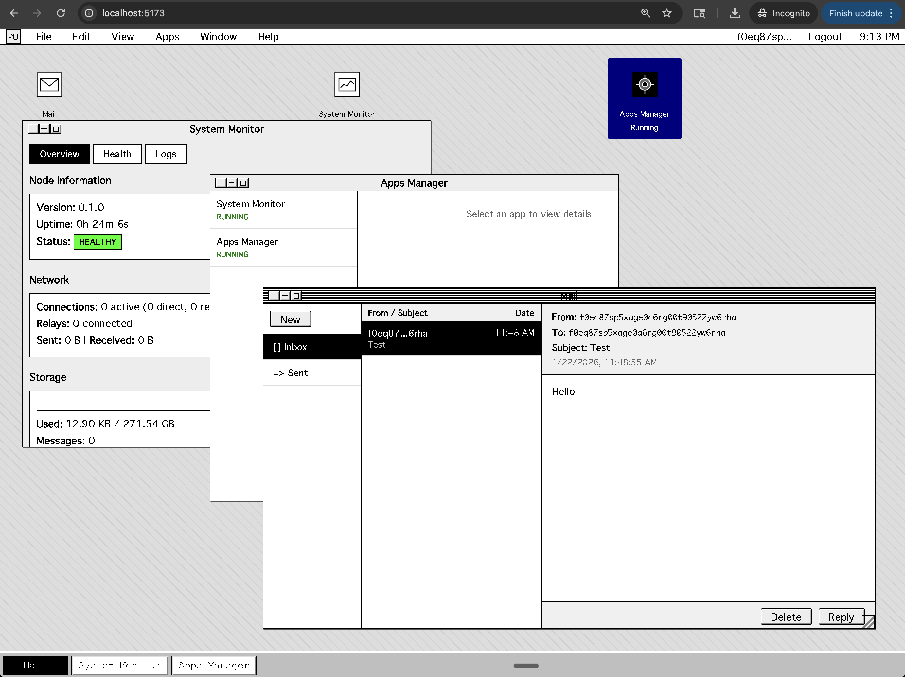

# Post-Urbit

Post-Urbit is a personal computing node for a user-owned, decentralized internet.
It pairs a Rust backend with a System 7-style web shell built in React/TypeScript.



## What it is

- Self-sovereign identity (keys you control)
- End-to-end encrypted messaging
- Peer-to-peer networking (QUIC + mailbox for offline delivery)
- WASM app sandbox with explicit permissions
- Desktop-style shell in your browser

## Quick Start

Prerequisites: Rust 1.70+ and Node.js 18+

**Backend:**
```bash
cd post-urbit-core
cargo run -- run --admin-password-hash '<argon2id_hash>'
```

**Frontend:**
```bash
cd post-urbit-core/packages/shell
npm install
npm run dev
```

Open `http://localhost:5173`. The frontend proxies API calls to the backend.

**Development mode** (bypasses auth, local only):
```bash
cd post-urbit-core
cargo run -- run --dev
```

**Ports:**
- Frontend: `http://localhost:5173`
- HTTP API: `http://localhost:8080`
- QUIC transport: UDP `4433`

## Repository Structure

```
post-urbit/
├── post-urbit-core/          # Main implementation
│   ├── src/                  # Rust backend source
│   │   ├── main.rs           # CLI entry point
│   │   ├── node.rs           # Node initialization & runtime
│   │   ├── node_http.rs      # HTTP API server
│   │   ├── identity.rs       # Identity management
│   │   ├── transport.rs      # QUIC networking
│   │   └── ...
│   ├── packages/
│   │   └── shell/            # React/TypeScript frontend
│   │       ├── src/
│   │       │   ├── components/   # UI components
│   │       │   ├── api/          # API hooks & types
│   │       │   └── context/      # React contexts
│   │       └── ...
│   ├── docs/                 # Technical documentation
│   └── screenshots/          # UI screenshots
│
├── spec/                     # Specifications & design documents
│   ├── 00-overview/          # Project overview & architecture
│   ├── 01-transport-connectivity/
│   ├── 02-identity-trust/
│   ├── 03-messaging-sync/
│   ├── 04-app-runtime/
│   ├── 05-ux-packaging/
│   ├── 06-rfcs/
│   └── progress.md           # Implementation progress tracking
│
└── post-urbit-spikes/        # Experimental prototypes
```

## Documentation

- [Introduction](post-urbit-core/docs/introduction.md)
- [HTTP API Reference](post-urbit-core/docs/api/http-api.md)
- [Building Apps](post-urbit-core/docs/apps/building-apps.md)
- [Identity System](post-urbit-core/docs/identity.md)
- [Messaging Protocol](post-urbit-core/docs/messaging.md)
- [Transport Layer](post-urbit-core/docs/transport.md)
- [Mailbox & DHT](post-urbit-core/docs/mailbox-and-dht.md)
- [Visual Design Spec](post-urbit-core/docs/specs/10-VISUAL_DESIGN.md)

For CLI options: `cargo run -- --help` from post-urbit-core.

## Contributing

See [CONTRIBUTING.md](post-urbit-core/CONTRIBUTING.md) for development guidelines.
