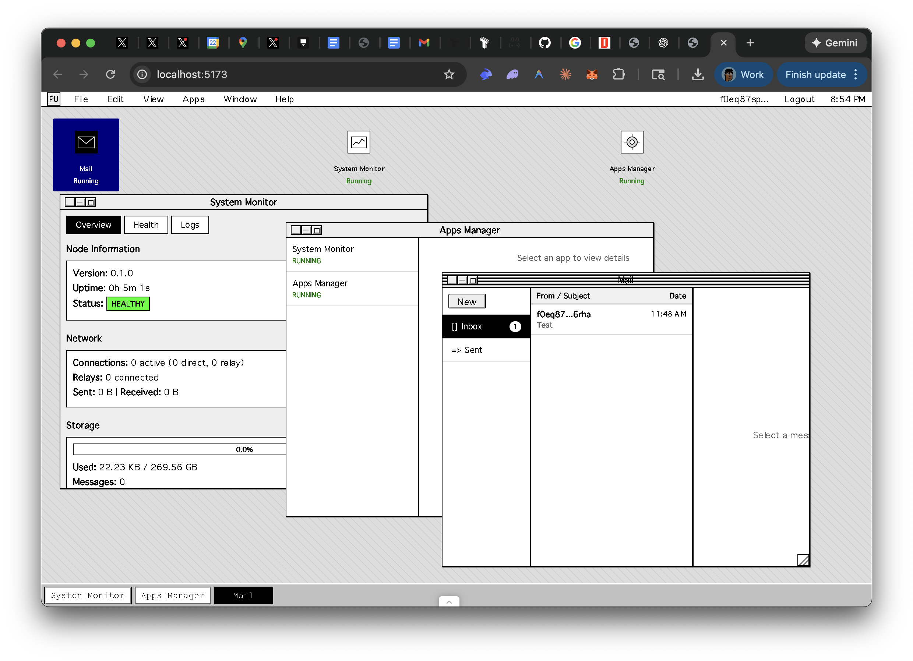
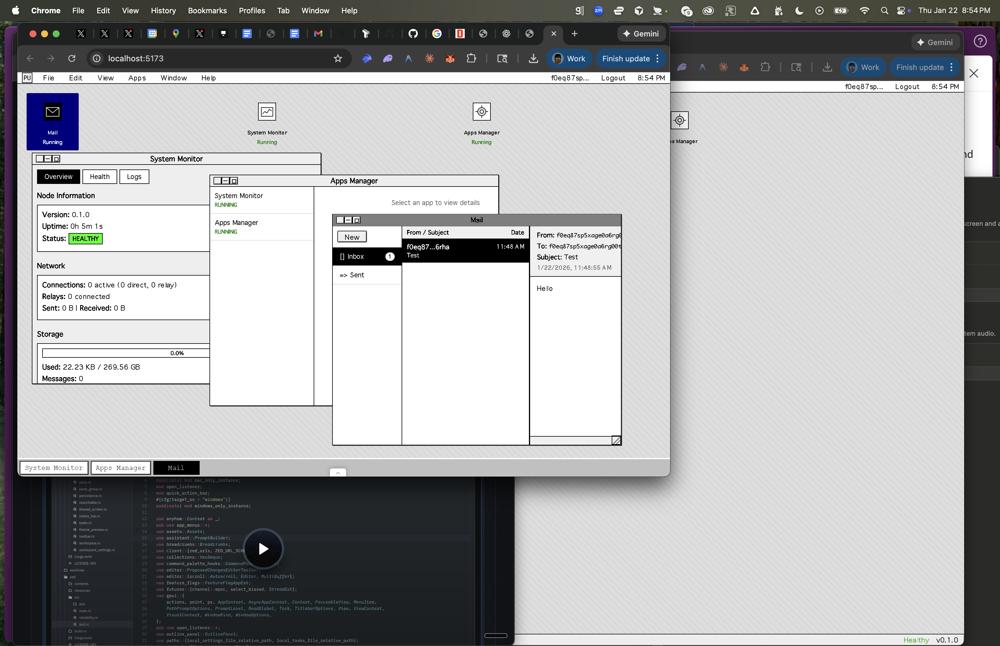
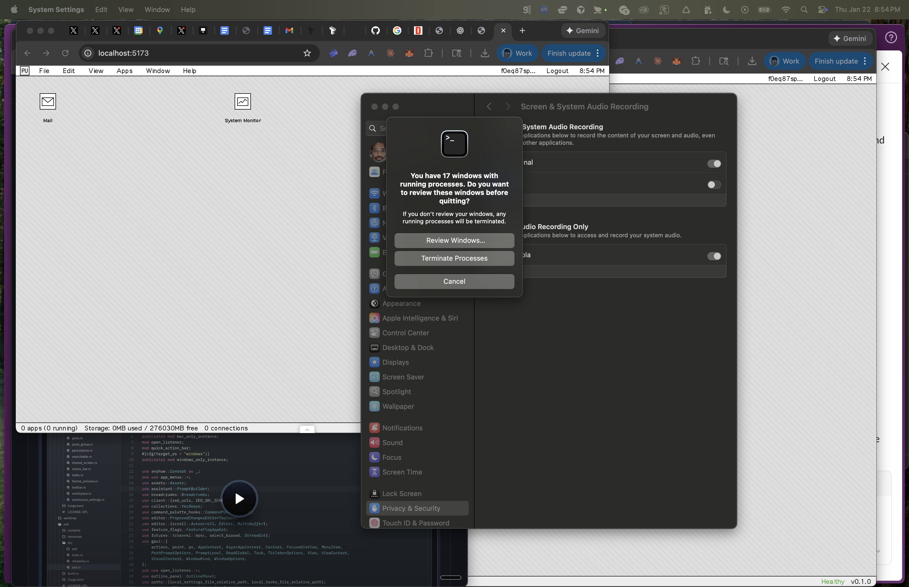

# Post-Urbit

A personal computing node for the decentralized internet with a System 7-styled web shell.



## Overview

Post-Urbit is your personal server that you control. It combines a Rust backend with a React/TypeScript frontend styled after Apple's classic Mac System 7 interface. Run a node, own your data, control your compute.

### Key Features

- **Self-Sovereign Identity** - Cryptographic identity (IID) derived from keys you control
- **End-to-End Encryption** - All messages use double-ratchet encryption
- **Peer-to-Peer Networking** - Direct QUIC connections between nodes
- **WASM App Sandbox** - Run third-party apps safely with capability-based permissions
- **System 7 Interface** - Nostalgic, functional desktop experience in your browser

## Screenshots

| Desktop | Windows | Full View |
|---------|---------|-----------|
|  |  |  |

The shell features:
- Classic Mac menu bar with File, Edit, View, Apps, Window, Help menus
- App grid with desktop icons
- Multi-window management (minimize, cascade, tile)
- System Monitor for health, logs, and status
- Mail app with inbox, sent, and compose
- Apps Manager for installed applications
- Dock for quick access to running apps

## Quick Start

### Prerequisites

- Rust 1.70+ and Cargo
- Node.js 18+ and npm

### Running the Backend

```bash
# Clone the repository
git clone https://github.com/dennisonbertram/post-urbit
cd post-urbit/post-urbit-core

# Build and run the node
cargo run

# Or build for release
cargo build --release
./target/release/post-urbit-core
```

The backend starts an HTTP API server on `http://localhost:4433` by default.

### Running the Frontend

```bash
# Navigate to the shell package
cd packages/shell

# Install dependencies
npm install

# Start the development server
npm run dev
```

Open `http://localhost:5173` in your browser. The frontend proxies API requests to the backend.

### Development Mode

For development, you can bypass authentication:

```bash
cargo run -- run --dev
```

**Warning**: Development mode is insecure and should never be used in production.

## Authentication

The shell uses password-based session authentication:

1. Set an admin password hash when starting the node:
   ```bash
   cargo run -- run --admin-password-hash '<argon2id_hash>'
   ```

2. Enter the password in the login prompt when accessing the shell

3. Sessions are stored via HTTP-only cookies with CSRF protection

See the [HTTP API documentation](docs/api/http-api.md) for details on authentication methods.

## Architecture

```
+------------------------------------------------------------------+
|                          Shell (React/TypeScript)                 |
|   Menu Bar | App Grid | Windows | Status Bar | Dock              |
+------------------------------------------------------------------+
                              |
                         HTTP API
                              |
+------------------------------------------------------------------+
|                        Node Core (Rust)                           |
|  +------------+  +------------+  +------------+  +------------+  |
|  |  Identity  |  |  Messaging |  |   Mailbox  |  |    Sync    |  |
|  +------------+  +------------+  +------------+  +------------+  |
|  +------------+  +------------+  +------------+  +------------+  |
|  |    DHT     |  |  Transport |  |    Apps    |  |   Runtime  |  |
|  +------------+  +------------+  +------------+  +------------+  |
+------------------------------------------------------------------+
```

### Backend Components

| Component | Description |
|-----------|-------------|
| Identity | IID derivation, key management, rotation, social recovery |
| Transport | QUIC/TLS 1.3 connections, NAT traversal |
| Messaging | PUSE envelope format, double-ratchet encryption |
| Mailbox | Async message delivery with bearer tokens |
| DHT | Distributed hash table for peer discovery |
| Sync | CRDT-based data synchronization |
| Apps | WASM sandbox, capability system, app lifecycle |

### Frontend Components

| Component | Description |
|-----------|-------------|
| MenuBar | Classic Mac menu with identity display and logout |
| AppGrid | Desktop icons for installed applications |
| WindowManager | Draggable, resizable windows with minimize/maximize |
| StatusBar | Node health, storage usage, connection status |
| Dock | Quick access to running applications |
| LoginPrompt | Password authentication dialog |

## CLI Options

```
post-urbit-core [COMMAND]

Commands:
  run           Start the node daemon (default)
  diagnostics   Run diagnostic commands

Run Options:
  --config <PATH>              Path to config file (TOML/JSON)
  --port <PORT>                QUIC listen port
  --data-dir <DIR>             Data directory for node state
  --http-addr <ADDR>           HTTP API listen address
  --admin-password-hash <HASH> Admin password (argon2id hash)
  --admin-token-hash <HASH>    Admin token (sha256 hex)
  --session-secret <HEX>       Session signing secret
  --session-timeout-hours <N>  Session timeout in hours
  -v, --verbose                Enable verbose logging
  --dev                        Development mode (bypasses auth)
```

## Documentation

| Document | Description |
|----------|-------------|
| [Introduction](docs/introduction.md) | Vision and core concepts |
| [HTTP API Reference](docs/api/http-api.md) | Complete REST API documentation |
| [Building Apps](docs/apps/building-apps.md) | Guide to building WASM apps |
| [Identity System](docs/identity.md) | IID derivation and key management |
| [Messaging Protocol](docs/messaging.md) | E2E encryption and message format |
| [Transport Layer](docs/transport.md) | QUIC connections and NAT traversal |
| [Mailbox & DHT](docs/mailbox-and-dht.md) | Async delivery and peer discovery |
| [Visual Design Spec](docs/specs/10-VISUAL_DESIGN.md) | System 7 design guidelines |

## Project Structure

```
post-urbit-core/
├── src/                    # Rust backend source
│   ├── main.rs            # CLI entry point
│   ├── node.rs            # Node orchestration
│   ├── node_http.rs       # HTTP API handlers
│   ├── identity.rs        # Identity management
│   ├── messaging.rs       # Message encryption
│   ├── mailbox.rs         # Mailbox storage
│   ├── dht.rs             # DHT implementation
│   └── ...
├── packages/
│   └── shell/             # React frontend
│       ├── src/
│       │   ├── api/       # API client and hooks
│       │   ├── components/
│       │   │   ├── shell/     # App-specific components
│       │   │   └── system7/   # Reusable UI primitives
│       │   └── context/   # React contexts
│       └── ...
├── docs/                  # Documentation
│   ├── api/              # API reference
│   ├── apps/             # App development guides
│   └── specs/            # Technical specifications
└── screenshots/          # UI screenshots
```

## Technology Stack

**Backend:**
- Rust with Tokio async runtime
- Quinn (QUIC transport)
- Wasmtime (WASM runtime)
- ed25519-dalek, x25519-dalek (cryptography)
- libp2p (DHT)

**Frontend:**
- React 18 with TypeScript
- Vite build system
- Custom System 7 CSS component library

## Contributing

See [CONTRIBUTING.md](CONTRIBUTING.md) for guidelines on contributing to this project.

## License

MIT License - see LICENSE file for details.

---

*Post-Urbit: Your server. Your data. Your rules.*
