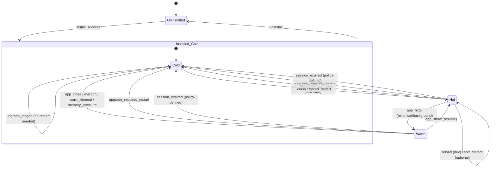

## 1) Required Sections (what the App Lifecycle Management spec MUST cover)

### 1.1 Scope, terminology, and security invariants
- **Terminology**: *Installed*, *Uninstalled*, *Hot/Warm/Cold* (reuse `AppRunState` from 02/03), *Focused*, *Pinned*, *Dev mode*, *Source*.
- **Security invariants (MUST restate + link)**:
  - App identity **derived from infrastructure**: `webview.label() == "app-{app_id}"` (02).
  - Apps have **no Tauri commands** except `postbridge_invoke` (02).
  - App UI served only via `postapp://{app_id}/...` protocol with traversal protections + CSP headers (02).
  - Resource manager may **evict** apps to Cold via deterministic LRU + graceful handshake (03).
  - SDK bootstrap token **in-memory only**, `UNAUTHORIZED` handling is **no refresh / no retry** (07).

### 1.2 App package format + manifest requirements
Define the “installable unit” and its rules:
- **Package types**:
  - Marketplace package (downloaded by shell)
  - Local package file (e.g., `.postapp`)
  - Dev install (directory or package with relaxed verification)
- **Manifest schema** (MUST include at least):
  - `app_id` (reverse-DNS, validated like `is_valid_app_id()` in 02)
  - `version` (SemVer)
  - `ui.entry` (default `index.html`)
  - `min_shell_version` / `bridge_v` compatibility gates
  - optional `requested_capabilities` / permissions metadata (ties into permission system spec)
  - `dev` flags (`dev_mode_allowed`, `hmr_url` optional, etc.)
- **Validation & fail-closed rules**: installation aborts if manifest missing/invalid, package exceeds limits (03 storage/package limits), signature invalid (if required), or extracted layout is wrong.

### 1.3 Installation trust model and provenance
- Define **source-of-truth** for “where the app came from” (marketplace listing id, local path, dev path).
- Define **integrity** requirements:
  - Marketplace: signature verification + hash pinning required
  - Local: signature optional but strongly recommended; user confirmation required
  - Dev: may bypass signature with explicit dev-mode gating + UI indicator (align 07 dev mode)
- Define an **audit trail** for install/update/uninstall events (consistent with “Audit Trail” principle in 02 and eviction logging in 03).

### 1.4 Runtime lifecycle orchestration (shell-owned)
- **State model**: Installed vs Uninstalled + Hot/Warm/Cold run state.
- **Lifecycle commands**: shell-only `app_launch/app_show/app_hide/app_close` from 02, plus install/update/uninstall commands.
- **Coordination rules** between:
  - `WebviewLifecycleManager` (02)
  - `ResourceManager` eviction engine (03)
  - `SessionManager` used by `postbridge_invoke` (02) and bootstrap (07)
  - `StorageManager` quotas/cleanup (03)

### 1.5 Versioning, upgrades, rollback, and migrations
- Atomic install/upgrade staging
- Handling upgrades while app is Hot/Warm
- Data migrations (app storage schema, persisted eviction state schema)
- Rollback policy if upgrade fails validation or crashes repeatedly

### 1.6 Dev mode lifecycle differences
- CSP exceptions per-app (07)
- File watching + reload-based dev loop (07)
- Inspector enablement (07)
- Relaxed install constraints (size/signature) only under dev gating

---

## 2) State Machine — complete app state transitions

You need **two coupled state dimensions**:

### 2.1 Install State (coarse)
- `Uninstalled`
- `Installed` (has files + registry entry)
- (Optional but useful) `Disabled` / `Corrupted` (failed validation, quarantined)

### 2.2 Run State (fine; only when Installed)
Reuse: `Cold` (no webview), `Warm` (hidden webview alive), `Hot` (visible).

### 2.3 Combined state diagram (recommended)
Represent as `Uninstalled` plus an `Installed::*` substates:

### 2.4 Transition rules (MUST specify)
- **Only shell** can cause state transitions via shell-only commands (02).
- **ResourceManager overrides**:
  - may demote Hot→Warm (count limit)
  - may evict Warm→Cold (count/time/pressure)
  - may evict Hot→Warm (critical pressure, excluding focused) (03)
- **Focused webview never evicted** (03).
- **Pinned app never auto-evicted** (03).

---

## 3) Installation Flow — from source to running app

Define a single pipeline with source-specific steps.

### 3.1 Common pipeline stages (all sources)
1. **Acquire**
   - Marketplace: download to temp
   - Local: read package file
   - Dev: register local directory / symlink / copy (your choice, but specify)
2. **Verify**
   - Validate `app_id` format (02 regex rules)
   - Validate manifest schema + `bridge_v` compatibility (07)
   - Enforce package size limits (03 `package_hard_limit_bytes`)
   - Integrity checks (signatures/hashes) per source policy
3. **Stage**
   - Extract into `apps_dir/.staging/{app_id}-{version}-{nonce}/`
   - Verify required paths exist (`ui/`, manifest file)
4. **Commit (atomic)**
   - Move staging dir to `apps_dir/{app_id}/` using atomic rename strategy
   - Update **installed app registry** (shell-owned metadata DB)
5. **Post-install hooks**
   - Precompute/store derived metadata: icon, entrypoint path, declared version, source, installed_at
   - Emit shell event `shell://apps/installed`
6. **Optional: auto-launch**
   - If requested, proceed to `app_launch` (Cold→Hot)

### 3.2 Source-specific requirements
**Marketplace**
- MUST verify:
  - publisher signature chain (or store signing key)
  - package hash equals listing hash
- SHOULD support:
  - background download + staged commit
  - “update available” state in registry

**Local**
- MUST:
  - show user confirmation (source is untrusted)
  - record provenance (file path + hash) in audit log
- MAY:
  - allow unsigned installs only with explicit user override

**Dev**
- MUST:
  - require shell dev mode ON + visible indicator (07)
  - allow reload-based development (file watch) (07)
- MAY relax:
  - package size limit
  - signature requirement
- MUST NOT relax:
  - webview isolation, bridge-only IPC, identity-from-label (02)

---

## 4) Launch/Close Flows — webview lifecycle coordination

### 4.1 Cold start launch (Installed Cold → Hot)
**Shell flow**
1. `app_launch(shell_webview, app_id)`
2. Lifecycle manager checks:
   - app installed + not corrupted/disabled
   - resource constraints: max hot/warm (03)
3. If hot slots full:
   - demote LRU Hot→Warm (excluding focused) (03)
   - if warm slots full: evict LRU Warm→Cold (03) with graceful handshake
4. Create webview:
   - label: `app-{app_id}` (02)
   - URL: `postapp://{app_id}/index.html`
   - attach navigation hook + popup blocker (02)
   - configure CSP headers via protocol handler (02)
   - configure capabilities: app-default (`postbridge:allow-invoke` only) (02)
5. Inject bootstrap object (`__POSTURBIT_BOOTSTRAP__`) (07)
6. Emit:
   - `app://lifecycle/created`
   - `app://lifecycle/shown`

### 4.2 Show/resume (Warm → Hot)
1. `app_show(shell_webview, app_id)`
2. Mark focused, bring to front
3. Emit `app://lifecycle/shown`
4. Update LRU `last_active`

### 4.3 Hide/minimize (Hot → Warm)
1. `app_hide(shell_webview, app_id)`
2. Hide window; keep webview alive
3. Emit `app://lifecycle/hidden`
4. ResourceManager may call platform suspend APIs where available (03 Windows `TrySuspend()`)

### 4.4 Close (Hot/Warm → Cold)
You need **two close types**:
- **User close** (normal): preserve installed files + app data
- **Eviction close** (resource): preserve persisted eviction state + app data

**Close sequence (recommended, consistent with 03 handshake)**
1. Shell decides to close/evict
2. Emit targeted `app://resource/evicting` (03) with deadline + reason  
   - Also emit `app://lifecycle/closed` immediately before destruction (02)
3. Allow app `prepare_for_unload` response (≤64KB, ≤deadline) (03)
4. Persist `PersistedAppState` (03) (last_url, geometry, scroll, optional blob)
5. Destroy webview
6. Transition to Cold

**Key coordination requirement**
- The **ResourceManager is authoritative** for eviction decisions; the **LifecycleManager is authoritative** for creating/destroying webviews. The spec should define the interface between them (e.g., `request_evict(app_id, reason) -> async completion`).

---

## 5) Session Lifecycle — how sessions relate to app states

### 5.1 Session binding rules (MUST)
- Session is created by shell and injected into the app via bootstrap (07).
- `postbridge_invoke` MUST:
  - derive `app_id` from `webview.label()` (02)
  - validate session/token/timestamp via `SessionManager` (02)
  - enforce session.app_id == derived app_id (02)

### 5.2 Recommended mapping of session to run state
Define explicitly:

| Run State | Webview exists | Session valid | Notes |
|---|---:|---:|---|
| Hot | Yes | Yes | Normal operation |
| Warm | Yes | Yes | Same session continues |
| Cold | No | No | Session is destroyed/invalidated |

**Implication**: Cold start always creates a **new** session + token.

### 5.3 Token expiry handling (resolve a spec gap)
07 mandates: SDK does **not** refresh; on `UNAUTHORIZED` it reloads the page. Your lifecycle spec MUST choose one of these policies:

**Policy A (simplest, recommended): “UNAUTHORIZED forces webview restart”**
- On `UNAUTHORIZED` from bridge:
  - shell closes webview (→Cold) and immediately relaunches (→Hot)
  - shell restores persisted state (03) so user impact is minimal

**Policy B: “In-place session rotation”**
- Shell rotates session/token while keeping webview alive and guarantees bootstrap reinjection on reload.
- Requires a precise mechanism (how bootstrap updates on same webview). If you can’t specify it concretely, don’t pick this.

### 5.4 Session invalidation triggers (MUST list)
- Webview destroyed (close/evict/crash) → invalidate session immediately
- App uninstall → invalidate session immediately
- Upgrade that requires restart → invalidate old session
- Security event (suspected compromise, repeated invalid HMAC, etc.) → revoke session + quarantine app (optional state)

---

## 6) Data Management — storage, cleanup, migration

### 6.1 Data categories (MUST enumerate)
1. **Installed UI bundle**: `apps_dir/{app_id}/ui/**` (served by `postapp://`) (02)
2. **Runtime web storage**: IndexedDB/localStorage per-origin (`postapp://{app_id}`) (02)
3. **Shell-managed app data**:
   - persisted eviction state (`PersistedAppState`) (03)
   - per-app logs (03)
   - permissions grants metadata (from permission spec)
   - install registry metadata (source, version, installed_at)
4. **Blobs / large objects** (if using blob namespace) (07)

### 6.2 Quotas and enforcement
- Enforce defaults from 03:
  - runtime quota default 256MB
  - per-app logs 20MB
  - global logs 100MB
  - package hard limit 150MB
- Emit storage quota warning/exceeded events (03).

### 6.3 Uninstall semantics (MUST be explicit)
On uninstall:
- Remove installed UI bundle directory
- Clear runtime web storage for that app origin
- Delete persisted eviction state blobs
- Delete per-app logs
- Revoke permissions grants for that app
- Invalidate any active session(s)
- Emit `shell://apps/uninstalled` with reason (user, policy, corruption)

Also define **“Uninstall while running”** handling:
- shell must close/evict to Cold first (graceful handshake optional)
- then perform deletion

### 6.4 Upgrades and migrations
**Upgrade flow requirements**
- Must be atomic: stage → validate → commit (avoid partial installs)
- Must record previous version for rollback (at least one version)
- Must decide “restart required?”:
  - If UI assets change, safest is restart (Cold relaunch)
  - If only metadata changes, may avoid restart

**Migration hooks (recommended)**
- Shell exposes a controlled “app upgraded” lifecycle event to app UI after relaunch:
  - `app://lifecycle/upgraded { from_version, to_version }`
- App can run migrations using its own storage APIs; shell does not grant extra powers.

**Rollback triggers**
- Post-upgrade crash loop threshold (ties into `crash_count` in 03)
- Validation failure on first launch of new version
- User-initiated rollback (dev mode)

---

## 7) Shell Integration — commands and events

### 7.1 Shell-only commands (extend existing)
You already have lifecycle commands in 02. Add install/update/uninstall and registry introspection.

**Suggested commands (Rust, shell-only enforced via `verify_shell_only`)**
- `shell_app_install(source: AppInstallSource, options)` → `{ app_id, version, installed_at }`
- `shell_app_uninstall(app_id, remove_data: bool = true)` → `()`
- `shell_app_update(app_id, source|marketplace_channel)` → `{ from_version, to_version, restart_required }`
- `shell_app_list_installed()` → list with metadata
- `shell_app_get_info(app_id)` → manifest + runtime state + source + version
- `shell_app_set_dev_mode(app_id, enabled)` (only if shell dev mode enabled)
- Keep 03 resource commands (`shell_evict_app`, quotas, etc.) as part of lifecycle admin surface.

### 7.2 Shell events (UI-facing)
Define a stable set; include timestamps and correlation IDs for audit:

- `shell://apps/installed { app_id, version, source, timestamp }`
- `shell://apps/updated { app_id, from_version, to_version, restart_required }`
- `shell://apps/uninstalled { app_id, reason, removed_data }`
- `shell://apps/launch_requested { app_id }`
- `shell://apps/state_changed { app_id, from: hot|warm|cold, to: ... }`
- Reuse 03 resource events (`shell://resources/eviction`, pressure updates)
- `shell://apps/dev_reload { app_id, changed_paths[] }` (dev mode only)

### 7.3 App-facing lifecycle events (inside app webview)
You already have:
- `app://lifecycle/created|shown|hidden|closed` (02)
Add (recommended):
- `app://lifecycle/upgraded`
- `app://lifecycle/focus_changed { focused: boolean }`
- Keep resource events from 03 (`app://resource/pressure`, `app://resource/evicting`)

---

## 8) Test Scenarios — key acceptance criteria

Organize tests by lifecycle domain and make them automatable.

### 8.1 Installation
- **Marketplace install success**: valid signature+hash, app appears in registry, files placed, event emitted.
- **Marketplace install fail**: signature invalid → no files committed, audit entry present.
- **Local install prompt**: user denies → no install.
- **Package too large**: >150MB rejected (03).
- **Manifest mismatch**: manifest `app_id` != expected/derived id → reject.
- **Path traversal in package**: extraction attempts `../` → reject/quarantine.

### 8.2 Launch / state transitions
- Cold→Hot launch creates `app-{app_id}` webview and serves `postapp://{app_id}/...` only.
- Hot→Warm hide keeps session working and preserves app state in memory.
- Warm→Hot show restores without new session.
- Warm timeout triggers Warm→Cold eviction (03).
- Exceed max hot count demotes LRU Hot→Warm (03).
- Focused app never evicted under pressure (03).

### 8.3 Eviction handshake + persistence
- `app://resource/evicting` emitted with deadline; app returns ≤64KB; state persisted (03).
- App returns >64KB → truncated and eviction continues (03).
- App does not respond → eviction proceeds at deadline (03).
- Relaunch restores last_url/geometry/blob as specified.

### 8.4 Session correctness and isolation
- App cannot invoke shell-only commands (02).
- App A cannot use App B’s session/token (02/07) → `Session/webview mismatch`.
- On session invalidation, policy is applied (restart/reload behavior as specified).

### 8.5 Upgrade flows
- Upgrade while Cold: commit new version; next launch uses new UI.
- Upgrade while Hot:
  - if restart_required: app transitions to Cold then Hot; state restored; session rotated.
  - if not required: no disruption (only if you explicitly support this)
- Crash-loop after upgrade triggers rollback to previous version.

### 8.6 Uninstall
- Uninstall while Cold: removes UI, clears runtime storage, logs, persisted state; registry updated; event emitted.
- Uninstall while Hot/Warm: app closed first; uninstall completes; further bridge calls fail.
- Reinstall after uninstall: no prior app data remains (unless user opted to keep data—if you support that option).

### 8.7 Dev mode differences
- Dev mode app shows visible DEV indicator; inspector enabled (07).
- File change triggers reload-based workflow without CSP changes (07).
- If dev HMR is enabled, CSP relaxation applies **only** to that dev app (07) and is removed when disabled.

---

### Final guidance to the subagent (implementation posture)
When writing the full spec, ensure every lifecycle operation is defined as:
- **(a) Preconditions** (installed? shell-only? resource limits?)
- **(b) Steps** (including events emitted, persistence written)
- **(c) Security checks** (identity-from-label, capability enforcement, validation)
- **(d) Failure modes** (and “fail closed” behavior)
- **(e) Observability** (audit log + metrics hooks aligned to 03)

If you want, I can also propose concrete Rust structs for the install registry (installed apps DB) and the `AppInstallSource` enum + an atomic staging directory strategy that works cross-platform.
