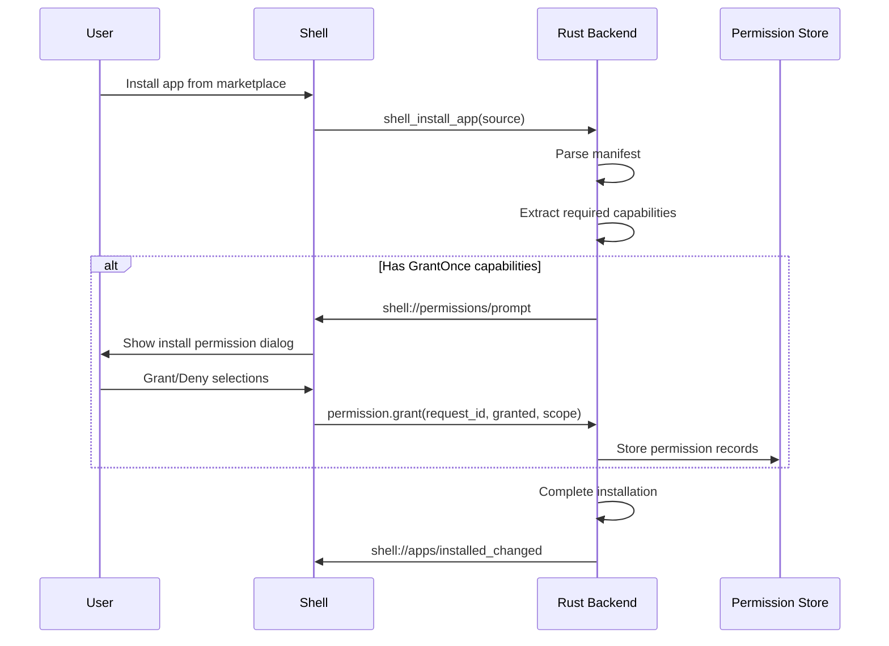
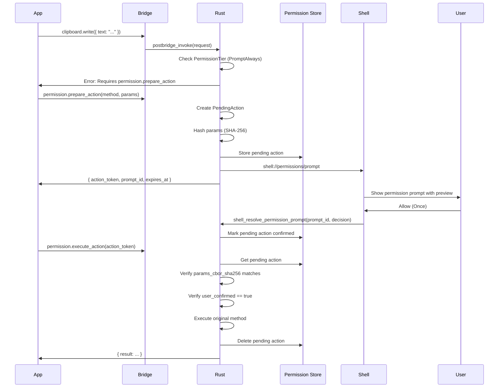
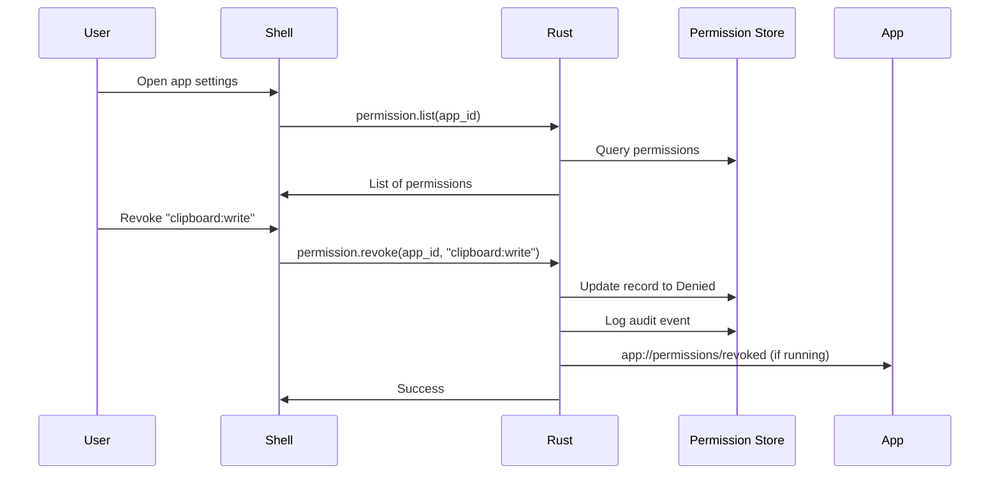

# 06 - Permission System Specification

**Status**: Draft
**Created**: 2026-01-20
**Loop**: 7

## 1. Overview and Goals

### Purpose

Define the complete permission system for managing capability grants between sandboxed apps and platform resources in Post-Urbit.

### Goals

- Provide users with clear, understandable permission prompts
- Protect users from malicious or misbehaving apps
- Enable apps to request capabilities with user consent
- Support both install-time and runtime permission granting
- Maintain an auditable record of permission decisions

### Non-Goals

- Network-level permissions (handled by CSP in sandbox)
- File system access (apps have no file system access)
- Device APIs (camera, mic blocked via Permissions-Policy)

### Trust Boundaries

```
+------------------------------------------------------------------+
|                         TRUSTED                                   |
|  +-------------+  +---------------+  +-------------------------+  |
|  | Rust Backend|  | Shell Webview |  | OS Keychain/DPAPI      |  |
|  +-------------+  +---------------+  +-------------------------+  |
+------------------------------------------------------------------+
                              |
              - - - - - - - - | - - - - - - - -  Permission Boundary
                              |
+------------------------------------------------------------------+
|                        UNTRUSTED                                  |
|  +-------------+  +-------------+  +----------------------------+ |
|  |App Webview A|  |App Webview B|  | App-provided content       | |
|  +-------------+  +-------------+  +----------------------------+ |
+------------------------------------------------------------------+
```

---

## 2. Terminology

| Term | Definition |
|------|------------|
| **Capability** | A specific permission identifier (e.g., `clipboard:write`) |
| **Permission** | The state of a capability grant for an app (granted/denied) |
| **MethodSpec** | Registry entry defining required capabilities for a bridge method |
| **Grant** | A recorded decision to allow an app a capability |
| **GrantScope** | Duration/extent of a grant: Once, Session, or Persistent |
| **Constraint** | Typed restriction on a capability (e.g., max bytes, allowed domains) |
| **PermissionTier** | Classification of how a capability is granted (from Registry) |

---

## 3. Data Models

### 3.1 Core Enums

```rust
use serde::{Deserialize, Serialize};
use chrono::{DateTime, Utc};

/// Decision on a permission request
#[derive(Debug, Clone, Copy, PartialEq, Eq, Serialize, Deserialize)]
#[serde(rename_all = "snake_case")]
pub enum PermissionDecision {
    Granted,
    Denied,
}

/// Scope/duration of a permission grant
#[derive(Debug, Clone, Copy, PartialEq, Eq, Serialize, Deserialize)]
#[serde(rename_all = "snake_case")]
pub enum GrantScope {
    /// Valid for this single action only
    Once,
    /// Valid until session ends (app closed or shell restart)
    Session,
    /// Persisted across sessions until explicitly revoked
    Persistent,
}

/// How the permission grant was obtained
#[derive(Debug, Clone, Copy, PartialEq, Eq, Serialize, Deserialize)]
#[serde(rename_all = "snake_case")]
pub enum GrantSource {
    /// Granted during app installation
    InstallPrompt,
    /// Granted via runtime prompt
    RuntimePrompt,
    /// Granted through shell settings UI
    ShellSettings,
    /// Applied by admin policy (enterprise)
    AdminPolicy,
    /// Auto-granted (AlwaysGranted tier)
    AutoGranted,
}

/// Risk level for UI display
#[derive(Debug, Clone, Copy, PartialEq, Eq, Serialize, Deserialize)]
#[serde(rename_all = "snake_case")]
pub enum RiskLevel {
    Low,      // No user data access
    Medium,   // App-scoped data
    High,     // User data access
    Critical, // System modification
}
```

### 3.2 Capability Constraints

```rust
/// Typed constraints on capabilities
#[derive(Debug, Clone, Serialize, Deserialize)]
#[serde(tag = "type", rename_all = "snake_case")]
pub enum CapabilityConstraint {
    /// No constraints
    None,

    /// Maximum bytes for data operations
    MaxBytes { limit: u64 },

    /// Allowed URL patterns
    UrlPatterns { patterns: Vec<String> },

    /// Rate limit constraint
    RateLimit {
        max_per_minute: u32,
        max_per_day: Option<u32>,
    },

    /// Time-bound constraint
    TimeWindow {
        start_hour: u8,  // 0-23
        end_hour: u8,    // 0-23
    },
}
```

### 3.3 Permission Record

```rust
/// Stored permission decision
#[derive(Debug, Clone, Serialize, Deserialize)]
pub struct PermissionRecord {
    /// Unique record ID
    pub id: String,

    /// App that was granted/denied
    pub app_id: String,

    /// Capability that was granted/denied
    pub capability: String,

    /// The decision
    pub decision: PermissionDecision,

    /// Scope of the grant (if granted)
    pub scope: GrantScope,

    /// How the grant was obtained
    pub source: GrantSource,

    /// Optional constraints
    pub constraints: Vec<CapabilityConstraint>,

    /// When the decision was made
    pub granted_at: DateTime<Utc>,

    /// When the grant expires (None = never for Persistent)
    pub expires_at: Option<DateTime<Utc>>,

    /// App version when granted (for escalation detection)
    pub app_version: String,

    /// Session ID (for session-scoped grants)
    pub session_id: Option<String>,

    /// User-provided reason (from manifest.capabilities.reasons)
    pub reason_shown: Option<String>,
}
```

### 3.4 Pending Action (TOCTOU)

```rust
/// Pending action for TOCTOU-safe execution
#[derive(Debug, Clone, Serialize, Deserialize)]
pub struct PendingAction {
    /// Unique action token
    pub action_token: String,

    /// App requesting the action
    pub app_id: String,

    /// Session ID for validation
    pub session_id: String,

    /// Required capability
    pub capability: String,

    /// Bridge method to execute
    pub method: String,

    /// SHA-256 hash of the CBOR-encoded params
    pub params_cbor_sha256: String,

    /// Original params (stored encrypted)
    pub params_cbor: Vec<u8>,

    /// When the pending action was created
    pub created_at: DateTime<Utc>,

    /// When the pending action expires (typically 5 minutes)
    pub expires_at: DateTime<Utc>,

    /// Whether user has confirmed (shell sets this)
    pub user_confirmed: bool,

    /// Prompt ID shown to user
    pub prompt_id: Option<String>,
}

/// Status of a pending action
#[derive(Debug, Clone, Copy, PartialEq, Eq, Serialize, Deserialize)]
#[serde(rename_all = "snake_case")]
pub enum PendingActionStatus {
    WaitingForUser,
    Approved,
    Denied,
    Consumed,
    Expired,
    Revoked,
}
```

### 3.5 Permission Request

```rust
/// Permission request for shell prompt
#[derive(Debug, Clone, Serialize, Deserialize)]
pub struct PermissionRequest {
    /// Unique request ID
    pub request_id: String,

    /// App requesting permission
    pub app_id: String,

    /// Capabilities being requested
    pub capabilities: Vec<CapabilityRequest>,

    /// Action token (if runtime request)
    pub action_token: Option<String>,

    /// When request was created
    pub created_at: DateTime<Utc>,

    /// Request context
    pub context: PermissionRequestContext,
}

#[derive(Debug, Clone, Serialize, Deserialize)]
pub struct CapabilityRequest {
    /// Capability identifier
    pub capability: String,

    /// Display name for UI
    pub display_name: String,

    /// Description for UI
    pub description: String,

    /// Risk level
    pub risk_level: RiskLevel,

    /// App-provided reason (from manifest)
    pub app_reason: Option<String>,

    /// Whether this is required or optional
    pub required: bool,
}

#[derive(Debug, Clone, Copy, PartialEq, Eq, Serialize, Deserialize)]
#[serde(rename_all = "snake_case")]
pub enum PermissionRequestContext {
    /// During app installation
    Install,
    /// During app update (new capabilities)
    Update,
    /// At runtime (user action triggered)
    Runtime,
}
```

---

## 4. Capability Catalog

### 4.1 Core Capabilities

| Capability | Description | Tier | Risk | Prompt Text |
|------------|-------------|------|------|-------------|
| `storage:app` | Read/write app-scoped storage | AlwaysGranted | Low | N/A (auto-granted) |
| `system:identity:read` | Read user's identity (IID, name) | GrantOnce | Medium | "Access your Post-Urbit identity name" |
| `external:open_url` | Open URLs in system browser | PromptAlways | High | "Open \"{url}\" in your browser" |
| `clipboard:write` | Write text to system clipboard | PromptAlways | High | "Copy \"{preview}\" to clipboard" |
| `clipboard:read` | Read text from system clipboard | PromptAlways | Critical | "Read from your clipboard" |
| `notifications:send` | Send system notifications | GrantOnce | Medium | "Send you notifications" |
| `resource:quota_increase` | Request storage quota increase | PromptAlways | Medium | "Increase storage from {current} to {requested}" |

### 4.2 Capability Definitions

```rust
/// Core capability definitions (loaded at startup)
pub fn core_capabilities() -> Vec<CapabilitySpec> {
    vec![
        CapabilitySpec {
            capability: "storage:app".into(),
            display_name: "App Storage".into(),
            description: "Store and retrieve app-specific data".into(),
            risk_level: RiskLevel::Low,
            default_tier: PermissionTier::AlwaysGranted,
            prompt_template: None,
            allow_persistent: true,
            allow_session: true,
            allow_constraints: false,
        },
        CapabilitySpec {
            capability: "system:identity:read".into(),
            display_name: "Identity Access".into(),
            description: "Access your Post-Urbit identity name".into(),
            risk_level: RiskLevel::Medium,
            default_tier: PermissionTier::GrantOnce,
            prompt_template: Some("Access your Post-Urbit identity".into()),
            allow_persistent: true,
            allow_session: true,
            allow_constraints: false,
        },
        CapabilitySpec {
            capability: "external:open_url".into(),
            display_name: "Open External URLs".into(),
            description: "Open links in your default browser".into(),
            risk_level: RiskLevel::High,
            default_tier: PermissionTier::PromptAlways,
            prompt_template: Some("Open \"{url}\" in your browser".into()),
            allow_persistent: false,
            allow_session: false,
            allow_constraints: true,
        },
        CapabilitySpec {
            capability: "clipboard:write".into(),
            display_name: "Copy to Clipboard".into(),
            description: "Copy text to your system clipboard".into(),
            risk_level: RiskLevel::High,
            default_tier: PermissionTier::PromptAlways,
            prompt_template: Some("Copy text to clipboard".into()),
            allow_persistent: false,
            allow_session: false,
            allow_constraints: true,
        },
        CapabilitySpec {
            capability: "clipboard:read".into(),
            display_name: "Read Clipboard".into(),
            description: "Read text from your system clipboard".into(),
            risk_level: RiskLevel::Critical,
            default_tier: PermissionTier::PromptAlways,
            prompt_template: Some("Read from your clipboard".into()),
            allow_persistent: false,
            allow_session: false,
            allow_constraints: true,
        },
        CapabilitySpec {
            capability: "notifications:send".into(),
            display_name: "Send Notifications".into(),
            description: "Show system notifications".into(),
            risk_level: RiskLevel::Medium,
            default_tier: PermissionTier::GrantOnce,
            prompt_template: Some("Send you notifications".into()),
            allow_persistent: true,
            allow_session: true,
            allow_constraints: true,
        },
    ]
}
```

---

## 5. Permission Tiers

### 5.1 Tier Semantics

| Tier | Behavior | Storage | Re-prompt |
|------|----------|---------|-----------|
| **AlwaysGranted** | Automatically granted, no prompt | Not stored | Never |
| **GrantOnce** | Prompt on first use, remember decision | Persistent | On revoke or app update |
| **PromptAlways** | Prompt every time | Once (not stored) | Every invocation |
| **ShellOnly** | Never granted to apps | N/A | N/A (always denied) |

### 5.2 Tier Decision Flow

```
                    +----------------+
                    | Method Called  |
                    +-------+--------+
                            |
                            v
                  +---------+---------+
                  | Check MethodSpec  |
                  | permission_tier   |
                  +---------+---------+
                            |
          +-----------------+------------------+
          |                 |                  |
          v                 v                  v
    +-----+-----+     +-----+-----+     +------+------+
    |AlwaysGrant|     | GrantOnce |     |PromptAlways|
    |  ed       |     |           |     |            |
    +-----+-----+     +-----+-----+     +------+------+
          |                 |                  |
          v                 v                  v
    +-----------+     +-----------+     +-------------+
    | AUTO GRANT|     | Check     |     | REQUIRE     |
    | (no prompt)|    | existing  |     | TOCTOU FLOW |
    +-----------+     | grant     |     +-------------+
                      +-----+-----+
                            |
              +-------------+-------------+
              |             |             |
              v             v             v
        +---------+   +---------+   +---------+
        | Granted |   | Denied  |   | Unknown |
        | -> Allow|   | -> Deny |   | -> Prompt|
        +---------+   +---------+   +---------+
```

---

## 6. Permission State Model

### 6.1 State Transitions

```
                    +-------------+
                    |   Unknown   | (No record exists)
                    +------+------+
                           |
              +------------+------------+
              |            |            |
              v            v            v
       +------+------+ +---+---+ +------+------+
       |   Granted   | |Granted| |   Granted   |
       |   (Once)    | |(Sess.)||(Persistent) |
       +------+------+ +---+---+ +------+------+
              |            |            |
              | Used       | Session    | Revoked
              v            | Ends       | or Update
       +------+------+     v            v
       |   Expired   | +---+---+ +------+------+
       |  (Unknown)  | |Expired| |   Denied    |
       +-------------+ |(Unkn.)||(Persistent) |
                       +-------+ +-------------+

Denied State:
+-------------+
|   Denied    | --- User re-grants --> Granted
| (Persistent)|
+-------------+
```

### 6.2 Precedence Rules

1. **Explicit denial** overrides any grant
2. **Persistent grants** survive session restart
3. **Session grants** expire on session end
4. **Once grants** expire immediately after use
5. **Constraints** are AND-ed together (most restrictive wins)

---

## 7. Authorization Pipeline

For every bridge request, execute these steps in order:

```rust
/// Authorization pipeline - MUST execute in this exact order
pub async fn authorize_request(
    registry: &ProtocolRegistry,
    permission_store: &PermissionStore,
    session: &AppSession,
    method: &str,
    params: &[u8],
) -> Result<AuthorizationResult, BridgeError> {
    // Step 1: Look up method in registry
    let method_spec = registry.get_method(method)
        .ok_or_else(|| BridgeError::invalid_request("Unknown method"))?;

    // Step 2: Check if ShellOnly
    if method_spec.permission_tier == PermissionTier::ShellOnly {
        return Err(BridgeError::unauthorized());
    }

    // Step 3: Check if AlwaysGranted (fast path)
    if method_spec.permission_tier == PermissionTier::AlwaysGranted {
        return Ok(AuthorizationResult::Proceed);
    }

    // Step 4: Get required capabilities
    let required_caps = &method_spec.required_capabilities;

    // Step 5: Check each capability
    for cap in required_caps {
        let cap_spec = registry.get_capability(cap)
            .ok_or_else(|| BridgeError::internal_error("Unknown capability"))?;

        // Step 6: Check permission store
        let record = permission_store.get_permission(&session.app_id, cap).await?;

        match (&record, method_spec.permission_tier) {
            // Has valid persistent grant
            (Some(r), _) if r.decision == PermissionDecision::Granted
                && r.scope == GrantScope::Persistent
                && !is_expired(r) => {
                continue; // Authorized
            }

            // Has valid session grant
            (Some(r), _) if r.decision == PermissionDecision::Granted
                && r.scope == GrantScope::Session
                && r.session_id.as_ref() == Some(&session.session_id) => {
                continue; // Authorized
            }

            // GrantOnce with existing denial
            (Some(r), PermissionTier::GrantOnce)
                if r.decision == PermissionDecision::Denied => {
                return Err(BridgeError::permission_denied(cap));
            }

            // PromptAlways - always needs prompt
            (_, PermissionTier::PromptAlways) => {
                return Ok(AuthorizationResult::RequiresPrompt {
                    capability: cap.clone(),
                    cap_spec: cap_spec.clone(),
                });
            }

            // GrantOnce without existing grant
            (None, PermissionTier::GrantOnce) => {
                return Ok(AuthorizationResult::RequiresPrompt {
                    capability: cap.clone(),
                    cap_spec: cap_spec.clone(),
                });
            }

            // Explicit denial
            (Some(r), _) if r.decision == PermissionDecision::Denied => {
                return Err(BridgeError::permission_denied(cap));
            }

            _ => {
                return Err(BridgeError::permission_denied(cap));
            }
        }
    }

    // Step 7: All capabilities authorized
    Ok(AuthorizationResult::Proceed)
}

pub enum AuthorizationResult {
    Proceed,
    RequiresPrompt {
        capability: String,
        cap_spec: CapabilitySpec,
    },
}

fn is_expired(record: &PermissionRecord) -> bool {
    if let Some(expires_at) = record.expires_at {
        Utc::now() > expires_at
    } else {
        false
    }
}
```

---

## 8. Bridge Methods

### 8.1 CDDL Schema

```cddl
; ============================
; Permission Methods
; ============================

; Check if permission is granted (without prompting)
permission-check-params = {
    capability: text,
}

permission-check-result = {
    granted: bool,
    scope: grant-scope / null,
    expires_at: text / null,  ; ISO 8601
}

; Prepare an action that requires permission (TOCTOU step 1)
permission-prepare-action-params = {
    method: text,
    params: any,                    ; Method-specific params
}

permission-prepare-action-result = {
    action_token: text,             ; Opaque token
    prompt_id: text,                ; ID of shell prompt
    expires_at: text,               ; ISO 8601, typically +5 minutes
    capability: text,               ; Required capability
    display_info: {
        capability_name: text,
        capability_description: text,
        action_preview: text,       ; Human-readable preview
        risk_level: risk-level,
    },
}

; Execute a prepared action (TOCTOU step 2)
permission-execute-action-params = {
    action_token: text,
}

permission-execute-action-result = {
    ; Result depends on original method
    result: any,
}

; Request permission grant (for install-time or explicit request)
permission-request-params = {
    capabilities: [+ text],
    context: permission-context,
}

permission-request-result = {
    request_id: text,
    prompt_id: text,
}

; Grant permission (shell-only)
permission-grant-params = {
    request_id: text,
    granted_capabilities: [* text],
    scope: grant-scope,
}

permission-grant-result = {
    success: bool,
}

; Revoke permission (shell-only)
permission-revoke-params = {
    app_id: text,
    capability: text,
}

permission-revoke-result = {
    success: bool,
}

; List permissions for app (shell-only)
permission-list-params = {
    app_id: text,
}

permission-list-result = {
    permissions: [* permission-record],
}

; Supporting types
grant-scope = "once" / "session" / "persistent"
risk-level = "low" / "medium" / "high" / "critical"
permission-context = "install" / "update" / "runtime"
```

### 8.2 Method Registry

| Method | Tier | Capabilities | Description |
|--------|------|--------------|-------------|
| `permission.check` | AlwaysGranted | None | Check permission status |
| `permission.prepare_action` | AlwaysGranted | None | Prepare TOCTOU action |
| `permission.execute_action` | AlwaysGranted | None | Execute prepared action |
| `permission.request` | AlwaysGranted | None | Request permissions |
| `permission.grant` | ShellOnly | None | Grant permission |
| `permission.revoke` | ShellOnly | None | Revoke permission |
| `permission.list` | ShellOnly | None | List app permissions |

---

## 9. User Consent UX Requirements

### 9.1 Shell-Rendered Prompts

All permission prompts MUST be rendered by the shell, never by apps.

```typescript
interface PermissionPromptProps {
  promptId: string;
  appId: string;
  appName: string;           // HTML-escaped
  appIcon: string | null;    // PNG only, max 512KB
  capabilities: CapabilityPrompt[];
  context: 'install' | 'update' | 'runtime';
  actionPreview?: string;    // For runtime prompts
  onGrant: (grantedCaps: string[], scope: GrantScope) => void;
  onDeny: () => void;
}

interface CapabilityPrompt {
  capability: string;
  displayName: string;
  description: string;
  riskLevel: RiskLevel;
  appReason?: string;        // HTML-escaped
  required: boolean;
}
```

### 9.2 Prompt Display Requirements

1. **Clear app identification**: App name and icon always visible
2. **Capability explanation**: System-provided description prominent
3. **Risk indicator**: Visual indicator of risk level
4. **App reason**: Displayed distinctly as "App says: ..."
5. **Action preview**: For runtime prompts, show what will happen
6. **Choice options**: Allow once / Allow session / Always allow / Deny

### 9.3 Anti-Spam Mechanisms

```rust
pub struct PromptRateLimiter {
    /// Max prompts per app per minute
    pub max_prompts_per_minute: u32,  // Default: 3

    /// Max prompts per app per hour
    pub max_prompts_per_hour: u32,    // Default: 10

    /// Cooldown after denial (seconds)
    pub denial_cooldown_secs: u64,    // Default: 60

    /// Global max concurrent prompts
    pub max_concurrent_prompts: usize, // Default: 1
}

impl PromptRateLimiter {
    pub fn check_can_prompt(&self, app_id: &str) -> Result<(), PromptRateLimitError> {
        // Check rate limits
        // Check if app was recently denied
        // Check concurrent prompt count
    }
}
```

### 9.4 Prompt Queueing

```typescript
// Shell manages prompt queue
interface PermissionPromptQueue {
  // Only one prompt visible at a time
  currentPrompt: PermissionPrompt | null;

  // Queued prompts
  queue: PermissionPrompt[];

  // Enqueue a new prompt
  enqueue(prompt: PermissionPrompt): void;

  // Resolve current prompt and show next
  resolve(promptId: string, result: PromptResult): void;

  // Dismiss prompt (denial)
  dismiss(promptId: string): void;
}
```

---

## 10. Persistence and Storage

### 10.1 Storage Location

| Platform | Location |
|----------|----------|
| Windows | `%APPDATA%/PostUrbit/permissions.db` |
| macOS | `~/Library/Application Support/PostUrbit/permissions.db` |
| Linux | `~/.local/share/PostUrbit/permissions.db` |

### 10.2 SQLite Schema

```sql
-- Schema version: 1

CREATE TABLE permission_records (
    id TEXT PRIMARY KEY,
    app_id TEXT NOT NULL,
    capability TEXT NOT NULL,
    decision TEXT NOT NULL CHECK(decision IN ('granted', 'denied')),
    scope TEXT NOT NULL CHECK(scope IN ('once', 'session', 'persistent')),
    source TEXT NOT NULL,
    constraints TEXT,        -- JSON array
    granted_at TEXT NOT NULL,
    expires_at TEXT,
    app_version TEXT NOT NULL,
    reason_shown TEXT,
    session_id TEXT,

    UNIQUE(app_id, capability)
);

CREATE INDEX idx_permission_app ON permission_records(app_id);
CREATE INDEX idx_permission_cap ON permission_records(capability);

CREATE TABLE pending_actions (
    action_token TEXT PRIMARY KEY,
    app_id TEXT NOT NULL,
    session_id TEXT NOT NULL,
    capability TEXT NOT NULL,
    method TEXT NOT NULL,
    params_cbor_sha256 TEXT NOT NULL,
    params_cbor BLOB NOT NULL,
    created_at TEXT NOT NULL,
    expires_at TEXT NOT NULL,
    user_confirmed INTEGER NOT NULL DEFAULT 0,
    prompt_id TEXT
);

CREATE INDEX idx_pending_expires ON pending_actions(expires_at);

CREATE TABLE permission_audit_log (
    id INTEGER PRIMARY KEY AUTOINCREMENT,
    timestamp TEXT NOT NULL,
    event_type TEXT NOT NULL,
    app_id TEXT NOT NULL,
    capability TEXT NOT NULL,
    source TEXT,
    details TEXT  -- JSON
);

CREATE INDEX idx_audit_time ON permission_audit_log(timestamp);
CREATE INDEX idx_audit_app ON permission_audit_log(app_id);

-- Schema version tracking
CREATE TABLE schema_version (
    version INTEGER PRIMARY KEY
);
INSERT INTO schema_version VALUES (1);
```

### 10.3 Migration Strategy

```rust
const PERMISSION_SCHEMA_VERSION: u32 = 1;

pub async fn migrate_permission_store(db: &SqlitePool) -> Result<()> {
    let version = get_schema_version(db).await?;

    match version {
        0 => {
            create_initial_schema(db).await?;
        }
        // Future migrations
        _ => {}
    }

    set_schema_version(db, PERMISSION_SCHEMA_VERSION).await?;
    Ok(())
}
```

---

## 11. Inheritance and Escalation Rules

### 11.1 No Implicit Inheritance

- Child capabilities do NOT inherit parent grants
- `clipboard:*` grant does NOT imply `clipboard:read`
- Each capability must be explicitly granted

### 11.2 Escalation on App Update

```rust
pub async fn check_app_update_permissions(
    store: &PermissionStore,
    app_id: &str,
    old_version: &str,
    new_manifest: &Manifest,
) -> Result<EscalationResult> {
    let existing = store.list_permissions(app_id).await?;
    let existing_caps: HashSet<_> = existing
        .iter()
        .filter(|r| r.decision == PermissionDecision::Granted)
        .map(|r| &r.capability)
        .collect();

    let new_required: HashSet<_> = new_manifest.capabilities.required
        .iter()
        .collect();

    let escalated: Vec<_> = new_required
        .difference(&existing_caps)
        .cloned()
        .collect();

    if escalated.is_empty() {
        Ok(EscalationResult::NoEscalation)
    } else {
        Ok(EscalationResult::RequiresPrompt {
            new_capabilities: escalated,
            context: PermissionRequestContext::Update,
        })
    }
}

pub enum EscalationResult {
    NoEscalation,
    RequiresPrompt {
        new_capabilities: Vec<String>,
        context: PermissionRequestContext,
    },
}
```

---

## 12. Auditing and Observability

### 12.1 Audit Events

```rust
#[derive(Debug, Clone, Serialize, Deserialize)]
#[serde(tag = "type", rename_all = "snake_case")]
pub enum PermissionAuditEvent {
    PermissionGranted {
        app_id: String,
        capability: String,
        scope: GrantScope,
        source: GrantSource,
    },
    PermissionDenied {
        app_id: String,
        capability: String,
        source: GrantSource,
    },
    PermissionRevoked {
        app_id: String,
        capability: String,
        revoked_by: String,
        reason: Option<String>,
    },
    ActionPrepared {
        app_id: String,
        capability: String,
        action_token: String,
        method: String,
    },
    ActionExecuted {
        app_id: String,
        capability: String,
        action_token: String,
        success: bool,
    },
    ActionExpired {
        app_id: String,
        action_token: String,
    },
    PromptRateLimited {
        app_id: String,
        capability: String,
    },
}
```

### 12.2 OpenTelemetry Spans

| Span Name | Attributes | Purpose |
|-----------|------------|---------|
| `permission.check` | `app_id`, `capability`, `result` | Permission check timing |
| `permission.prepare_action` | `app_id`, `capability`, `method` | Action preparation |
| `permission.prompt` | `app_id`, `capability`, `context` | Prompt display timing |
| `permission.execute_action` | `app_id`, `action_token`, `success` | Action execution |
| `permission.revoke` | `app_id`, `capability` | Revocation |

---

## 13. Critical Flows

### 13.1 Install-Time Permission Flow



### 13.2 Runtime Permission Flow (TOCTOU)



### 13.3 Revocation Flow



---

## 14. Security Considerations

### 14.1 Prompt Spoofing / UI Redress

**Threat**: Malicious app overlays fake UI to trick user.

**Mitigation**:
- All prompts rendered by shell in trusted webview
- Apps cannot render outside their webview bounds
- Clear visual distinction between shell UI and app content
- App name always shown (HTML-escaped)

### 14.2 TOCTOU with params_cbor_sha256 Binding

**Threat**: App changes parameters between prepare and execute.

**Mitigation**:
```rust
pub fn verify_action_params(
    pending: &PendingAction,
    original_params: &[u8],
) -> Result<(), SecurityError> {
    let computed_hash = sha256_hex(original_params);

    if computed_hash != pending.params_cbor_sha256 {
        return Err(SecurityError::ParamsMismatch);
    }

    Ok(())
}
```

### 14.3 Confused Deputy Prevention

**Threat**: App tricks shell into performing actions on its behalf.

**Mitigation**:
- Identity derived from webview label, never from request
- Session bound to specific webview
- Action tokens bound to specific session

### 14.4 Consent Phishing via App-Controlled Text

**Threat**: App provides misleading reason text.

**Mitigation**:
- App-provided reasons displayed in distinct style
- System-provided capability descriptions shown prominently
- Risk level indicator always visible
- Max length limits enforced (128 chars)

### 14.5 Prompt Spam / Denial-of-UX

**Mitigation**:
- Rate limiting (3/minute, 10/hour per app)
- Cooldown after denial (60 seconds)
- Max 1 prompt visible at a time
- Repeated denials can trigger app suspension

### 14.6 Permission Store Tampering

**Mitigation**:
- SQLite file permissions restricted to user
- Integrity check on startup
- Audit log for all changes
- Consider encryption at rest (future)

### 14.7 Replay / Duplicate Execute

**Mitigation**:
- Action tokens are single-use
- Deleted immediately after execution or expiration
- Short expiration window (5 minutes)

---

## 15. Test Scenarios

### 15.1 Core Authorization Tests

1. **AlwaysGranted capability is auto-granted without prompt**
   - Given: App calls `storage.get`
   - Expected: Succeeds immediately, no prompt

2. **GrantOnce capability prompts on first use**
   - Given: App calls method requiring `system:identity:read`
   - Expected: Prompt shown, decision persisted

3. **GrantOnce with existing grant succeeds silently**
   - Given: App previously granted `system:identity:read`, calls again
   - Expected: Succeeds without prompt

4. **PromptAlways capability prompts every time**
   - Given: App calls `external.open_url` twice
   - Expected: Two prompts shown

5. **ShellOnly capability always denied to apps**
   - Given: App attempts `shell.launch_app`
   - Expected: UNAUTHORIZED error

### 15.2 TOCTOU Tests

6. **prepare_action creates PendingAction**
   - Given: App calls `permission.prepare_action` for clipboard
   - Expected: action_token returned, prompt shown

7. **execute_action fails without confirmation**
   - Given: App calls `permission.execute_action` without user confirm
   - Expected: Error (not confirmed)

8. **execute_action fails with wrong params**
   - Given: App modifies params between prepare and execute
   - Expected: Error (params mismatch)

9. **execute_action succeeds after confirmation**
   - Given: Full TOCTOU flow with user confirmation
   - Expected: Action executes, pending action deleted

10. **Expired action_token is rejected**
    - Given: Wait 6 minutes after prepare_action
    - Expected: Error (action expired)

### 15.3 Persistence Tests

11. **Revocation prevents future use**
    - Given: Revoke `clipboard:write`, app tries to use
    - Expected: PERMISSION_DENIED

12. **Rate limiting blocks prompt spam**
    - Given: App requests 5 prompts in 1 minute
    - Expected: 4th and 5th rate limited

13. **App update with new capabilities triggers escalation prompt**
    - Given: App v1 had `storage:app`, v2 adds `clipboard:write`
    - Expected: Prompt for new capability during update

---

## 16. Implementation Checklist

### Phase 1: Core Data Structures
- [ ] Define `PermissionDecision`, `GrantScope`, `GrantSource` enums
- [ ] Define `CapabilityConstraint` enum
- [ ] Define `PermissionRecord` struct
- [ ] Define `PendingAction` struct
- [ ] Define `PermissionRequest` struct

### Phase 2: Permission Store
- [ ] Create SQLite schema
- [ ] Implement `PermissionStore` with CRUD operations
- [ ] Implement permission lookup by (app_id, capability)
- [ ] Implement session-scoped grant tracking
- [ ] Implement expiration checking
- [ ] Add migration support

### Phase 3: Authorization Pipeline
- [ ] Implement 7-step authorization pipeline
- [ ] Integrate with `ProtocolRegistry`
- [ ] Integrate with `BridgeHandler`
- [ ] Add logging and metrics

### Phase 4: TOCTOU Flow
- [ ] Implement `permission.prepare_action` bridge method
- [ ] Implement `permission.execute_action` bridge method
- [ ] Implement params hash verification
- [ ] Implement action expiration
- [ ] Implement single-use token enforcement

### Phase 5: Shell Integration
- [ ] Define `shell://permissions/prompt` event
- [ ] Define `shell://permissions/revoked` event
- [ ] Implement `shell_resolve_permission_prompt` command
- [ ] Implement prompt queue in shell
- [ ] Implement rate limiting

### Phase 6: Audit and Observability
- [ ] Create audit log table
- [ ] Implement audit event logging
- [ ] Add OpenTelemetry spans
- [ ] Create diagnostics export

### Phase 7: Install-Time Permissions
- [ ] Extract capabilities from manifest
- [ ] Trigger prompt during installation
- [ ] Store initial grants
- [ ] Handle partial grants (optional capabilities)

### Phase 8: App Update Handling
- [ ] Detect capability changes on update
- [ ] Trigger escalation prompt
- [ ] Preserve existing grants
- [ ] Handle downgrades gracefully

---

## 17. Acceptance Criteria Matrix

| Requirement | Acceptance Criteria | Test Method |
|-------------|---------------------|-------------|
| AlwaysGranted auto-grant | `storage.get` succeeds without prompt | Unit test |
| GrantOnce persistence | Grant survives app restart | Integration test |
| PromptAlways prompts | `external.open_url` prompts every time | Integration test |
| ShellOnly blocked | `shell.*` methods return UNAUTHORIZED | Unit test |
| TOCTOU binding | Params change detection works | Unit test |
| Single-use tokens | Second execute fails | Unit test |
| Expiration | 6-minute-old token rejected | Unit test |
| Rate limiting | 4th prompt in 1 minute blocked | Integration test |
| Revocation | Revoked capability denied | Integration test |
| Escalation | New capability prompts on update | Integration test |
| Audit logging | All events logged | Integration test |
| Shell rendering | Prompts appear in shell UI | E2E test |
| Keyboard accessible | Prompt navigable with keyboard | Manual/A11y test |

---

## Appendix A: Integration with Other Specs

### A.1 Protocol Registry (05)
- Uses `PermissionTier` enum from registry
- Uses `CapabilitySpec` for capability metadata
- Enforces `MethodSpec.required_capabilities`

### A.2 Secure Bridge Protocol (04)
- `permission.*` methods use same CBOR encoding
- Subject to same rate limiting
- Uses same session management

### A.3 App Sandbox (02)
- Prompts rendered in shell webview only
- External effects (open URL) route through shell
- CSP does not affect permission checks

### A.4 Shell Architecture (01)
- Uses `PermissionsSlice` in Zustand
- Implements `PermissionPrompt` component
- Handles `shell://permissions/prompt` events
