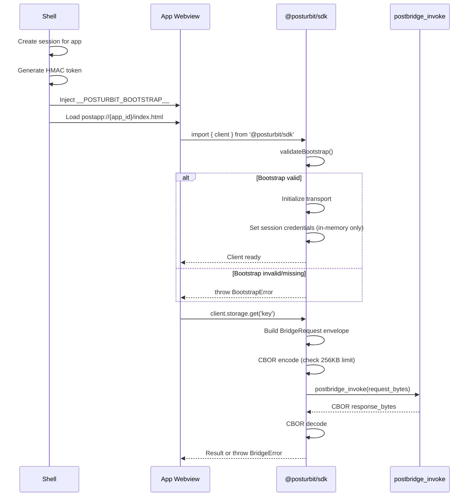
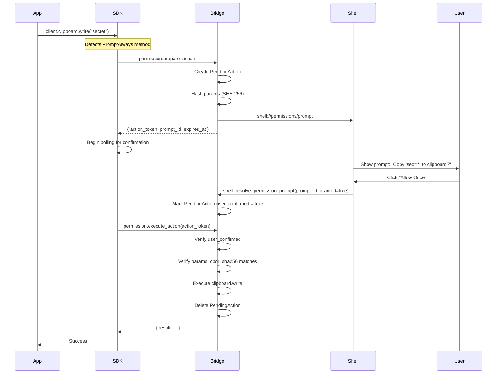

# 07 - SDK & Developer Experience Specification

**Status**: Draft
**Created**: 2026-01-20
**Loop**: 8

## 1. Overview and Goals

### Purpose

Define the complete TypeScript SDK, tooling, and developer workflow for building applications on the Post-Urbit frontend platform. The SDK provides a type-safe, ergonomic interface to platform APIs while maintaining strict security boundaries.

### Goals

- Provide a clean, React-friendly API surface that abstracts transport complexity
- Generate type-safe interfaces from CDDL schemas
- Offer a complete CLI toolchain for app development lifecycle
- Enable efficient local development with CSP-compatible workflows
- Maintain strict security boundaries - SDK cannot bypass platform restrictions

### Non-Goals

- Expose raw Tauri APIs to apps
- Provide escape hatches from sandbox restrictions
- Support direct network access

### Related Specifications

- 02-APP_SANDBOX_ISOLATION.md - Webview isolation and custom protocol
- 04-SECURE_BRIDGE_PROTOCOL.md - Bridge transport and CBOR encoding
- 05-PROTOCOL_REGISTRY.md - Method registry and introspection
- 06-PERMISSION_SYSTEM.md - Permission tiers and TOCTOU flow

---

## 2. Package Architecture

### 2.1 Package Structure

```
@posturbit/
├── sdk/                    # Main SDK package
│   ├── src/
│   │   ├── index.ts        # Public API exports
│   │   ├── client.ts       # PostUrbitClient singleton
│   │   ├── bootstrap.ts    # Bootstrap parsing and validation
│   │   ├── transport.ts    # Private transport layer
│   │   ├── codec.ts        # CBOR encode/decode with limits
│   │   ├── protocol.ts     # BridgeRequest envelope building
│   │   ├── errors.ts       # Error classes
│   │   ├── namespaces/     # Typed API facades
│   │   │   ├── storage.ts
│   │   │   ├── system.ts
│   │   │   ├── events.ts
│   │   │   ├── permission.ts
│   │   │   ├── resource.ts
│   │   │   ├── external.ts
│   │   │   ├── clipboard.ts
│   │   │   └── blob.ts
│   │   └── react/          # React hooks
│   │       ├── index.ts
│   │       ├── useStorage.ts
│   │       ├── useIdentity.ts
│   │       ├── useEvents.ts
│   │       └── useResourcePressure.ts
│   ├── package.json
│   └── tsconfig.json
│
├── protocol/               # Protocol types (generated)
│   ├── src/
│   │   ├── index.ts        # Type exports
│   │   ├── methods.ts      # MethodName union, MethodParams, MethodResult
│   │   ├── errors.ts       # BridgeErrorCode enum
│   │   └── schemas.ts      # CDDL-derived types
│   ├── package.json
│   └── tsconfig.json
│
└── devtools/               # CLI and development tools
    ├── src/
    │   ├── cli.ts          # CLI entry point
    │   ├── commands/
    │   │   ├── init.ts
    │   │   ├── dev.ts
    │   │   ├── build.ts
    │   │   ├── package.ts
    │   │   ├── install.ts
    │   │   ├── typegen.ts
    │   │   └── doctor.ts
    │   ├── templates/
    │   │   ├── hello-world/
    │   │   ├── events-demo/
    │   │   └── permission-toctou/
    │   └── inspector/      # Bridge inspector (dev mode)
    │       ├── BridgeInspector.tsx
    │       └── inject.ts
    ├── package.json
    └── bin/
        └── posturbit
```

### 2.2 Package Responsibilities

| Package | Responsibility |
|---------|----------------|
| `@posturbit/sdk` | Main SDK - client, namespaces, hooks |
| `@posturbit/protocol` | Generated types from CDDL schemas |
| `@posturbit/devtools` | CLI toolchain and dev utilities |

### 2.3 Dependency Graph

```
@posturbit/sdk
    └── @posturbit/protocol (types only, no runtime)

@posturbit/devtools
    ├── @posturbit/sdk (for templates)
    └── @posturbit/protocol (for typegen)
```

---

## 3. Bootstrap Flow

### 3.1 Shell-Injected Bootstrap Object

When the shell creates an app webview, it injects a bootstrap object before loading app content:

```typescript
// Injected by shell into window.__POSTURBIT_BOOTSTRAP__
interface PostUrbitBootstrap {
  /** Bridge protocol version */
  bridge_v: 1;

  /** App identifier (reverse DNS) */
  app_id: string;

  /** Session identifier (UUID) */
  session_id: string;

  /** HMAC authentication token */
  token: string;

  /** Token issuance timestamp (ms since epoch) */
  issued_at_ms: number;

  /** Token expiration timestamp (ms since epoch) */
  expires_at_ms: number;

  /** Granted capabilities for this session */
  capabilities: string[];

  /** Dev mode flag (enables inspector) */
  dev_mode?: boolean;

  /** Dev mode nonce for CSP script injection */
  dev_nonce?: string;
}
```

### 3.2 Bootstrap Validation

```typescript
// @posturbit/sdk/src/bootstrap.ts

export interface ValidatedBootstrap {
  bridgeVersion: 1;
  appId: string;
  sessionId: string;
  token: string;
  issuedAt: Date;
  expiresAt: Date;
  capabilities: ReadonlySet<string>;
  devMode: boolean;
  devNonce?: string;
}

export class BootstrapError extends Error {
  constructor(
    public readonly code:
      | 'MISSING'
      | 'INVALID_VERSION'
      | 'MISSING_FIELD'
      | 'EXPIRED'
      | 'INVALID_TIMESTAMP',
    message: string
  ) {
    super(message);
    this.name = 'BootstrapError';
  }
}

export function validateBootstrap(): ValidatedBootstrap {
  const raw = (window as any).__POSTURBIT_BOOTSTRAP__;

  if (!raw) {
    throw new BootstrapError('MISSING', 'Bootstrap object not found');
  }

  if (raw.bridge_v !== 1) {
    throw new BootstrapError('INVALID_VERSION', `Unsupported bridge version: ${raw.bridge_v}`);
  }

  const required = ['app_id', 'session_id', 'token', 'issued_at_ms', 'expires_at_ms'];
  for (const field of required) {
    if (!(field in raw)) {
      throw new BootstrapError('MISSING_FIELD', `Missing required field: ${field}`);
    }
  }

  const issuedAt = new Date(raw.issued_at_ms);
  const expiresAt = new Date(raw.expires_at_ms);

  if (isNaN(issuedAt.getTime()) || isNaN(expiresAt.getTime())) {
    throw new BootstrapError('INVALID_TIMESTAMP', 'Invalid timestamp format');
  }

  if (Date.now() > raw.expires_at_ms) {
    throw new BootstrapError('EXPIRED', 'Bootstrap token has expired');
  }

  return {
    bridgeVersion: 1,
    appId: raw.app_id,
    sessionId: raw.session_id,
    token: raw.token,
    issuedAt,
    expiresAt,
    capabilities: new Set(raw.capabilities || []),
    devMode: raw.dev_mode === true,
    devNonce: raw.dev_nonce,
  };
}
```

### 3.3 Bootstrap Flow Diagram



### 3.4 Session Expiry Handling

**CRITICAL**: The SDK MUST NOT auto-retry or auto-refresh sessions. On `UNAUTHORIZED` error:

```typescript
// @posturbit/sdk/src/transport.ts

async function handleResponse(response: BridgeResponse): Promise<any> {
  if (!response.ok) {
    const error = response.error!;

    if (error.code === 'UNAUTHORIZED') {
      // Session expired or invalid - trigger app reload
      // Do NOT attempt auto-retry or token refresh
      console.error('[PostUrbit] Session expired. Reloading app.');
      window.location.reload();
      throw new BridgeError(error); // Won't reach here
    }

    throw new BridgeError(error);
  }

  return response.result;
}
```

---

## 4. SDK Architecture

### 4.1 Transport Layer (Private)

The transport layer wraps Tauri's `invoke` and is NOT exported publicly.

```typescript
// @posturbit/sdk/src/transport.ts (PRIVATE)

import { invoke } from '@tauri-apps/api/core';
import { encode, decode } from './codec';
import { BridgeRequest, BridgeResponse } from '@posturbit/protocol';

const MAX_REQUEST_SIZE = 256 * 1024; // 256KB

export class Transport {
  private readonly sessionId: string;
  private readonly token: string;
  private requestCounter = 0;

  constructor(bootstrap: ValidatedBootstrap) {
    this.sessionId = bootstrap.sessionId;
    this.token = bootstrap.token;
  }

  async invoke(method: string, params: unknown): Promise<unknown> {
    const request: BridgeRequest = {
      v: 1,
      id: this.generateRequestId(),
      ts: Date.now(),
      session: this.sessionId,
      token: this.token,
      method,
      params: params ?? null,
    };

    const requestBytes = encode(request);

    if (requestBytes.length > MAX_REQUEST_SIZE) {
      throw new PayloadTooLargeError(requestBytes.length, MAX_REQUEST_SIZE);
    }

    // ONLY valid Tauri command for apps
    const responseBytes = await invoke<number[]>('postbridge_invoke', {
      request_bytes: Array.from(requestBytes),
    });

    const response = decode(new Uint8Array(responseBytes)) as BridgeResponse;
    return handleResponse(response);
  }

  private generateRequestId(): string {
    return `${this.sessionId.slice(0, 8)}-${++this.requestCounter}-${Date.now().toString(36)}`;
  }
}
```

### 4.2 CBOR Codec with Client-Side Limits

```typescript
// @posturbit/sdk/src/codec.ts

import * as cbor from 'cbor-x';

const MAX_PAYLOAD_SIZE = 256 * 1024; // 256KB
const MAX_NESTING_DEPTH = 32;
const MAX_COLLECTION_LENGTH = 1000;
const MAX_STRING_LENGTH = 65536;

export function encode(value: unknown): Uint8Array {
  validateForEncode(value, 0);
  return cbor.encode(value);
}

export function decode(bytes: Uint8Array): unknown {
  if (bytes.length > MAX_PAYLOAD_SIZE) {
    throw new CodecError('PAYLOAD_TOO_LARGE', `Payload exceeds ${MAX_PAYLOAD_SIZE} bytes`);
  }
  return cbor.decode(bytes);
}

function validateForEncode(value: unknown, depth: number): void {
  if (depth > MAX_NESTING_DEPTH) {
    throw new CodecError('NESTING_TOO_DEEP', `Exceeded max nesting depth of ${MAX_NESTING_DEPTH}`);
  }

  if (Array.isArray(value)) {
    if (value.length > MAX_COLLECTION_LENGTH) {
      throw new CodecError('COLLECTION_TOO_LARGE', `Array exceeds ${MAX_COLLECTION_LENGTH} items`);
    }
    value.forEach(item => validateForEncode(item, depth + 1));
  } else if (value !== null && typeof value === 'object') {
    const keys = Object.keys(value as object);
    if (keys.length > MAX_COLLECTION_LENGTH) {
      throw new CodecError('COLLECTION_TOO_LARGE', `Object exceeds ${MAX_COLLECTION_LENGTH} keys`);
    }
    Object.values(value as object).forEach(v => validateForEncode(v, depth + 1));
  } else if (typeof value === 'string') {
    if (value.length > MAX_STRING_LENGTH) {
      throw new CodecError('STRING_TOO_LONG', `String exceeds ${MAX_STRING_LENGTH} characters`);
    }
  }
}

export class CodecError extends Error {
  constructor(
    public readonly code: 'PAYLOAD_TOO_LARGE' | 'NESTING_TOO_DEEP' | 'COLLECTION_TOO_LARGE' | 'STRING_TOO_LONG',
    message: string
  ) {
    super(message);
    this.name = 'CodecError';
  }
}
```

### 4.3 Protocol Client (Envelope Builder)

```typescript
// @posturbit/sdk/src/protocol.ts

import type { MethodName, MethodParams, MethodResult } from '@posturbit/protocol';
import { Transport } from './transport';

export interface InvokeOptions {
  /** Request timeout in milliseconds (default: 30000) */
  timeout?: number;

  /** Explicit idempotency key for safe retries */
  idempotencyKey?: string;

  /** Distributed tracing ID */
  traceId?: string;
}

export class ProtocolClient {
  constructor(private readonly transport: Transport) {}

  async invoke<M extends MethodName>(
    method: M,
    params: MethodParams[M],
    options?: InvokeOptions
  ): Promise<MethodResult[M]> {
    const payload: Record<string, unknown> = { ...params };

    if (options?.idempotencyKey) {
      payload.__idempotency_key = options.idempotencyKey;
    }

    if (options?.traceId) {
      payload.__trace_id = options.traceId;
    }

    const result = await this.transport.invoke(method, payload);
    return result as MethodResult[M];
  }
}
```

### 4.4 Error Classes

```typescript
// @posturbit/sdk/src/errors.ts

import type { BridgeErrorCode } from '@posturbit/protocol';

export class BridgeError extends Error {
  constructor(
    public readonly code: BridgeErrorCode,
    message: string,
    public readonly errorId?: string,
    public readonly retryable: boolean = false,
    public readonly retryAfterMs?: number,
    public readonly details?: Record<string, unknown>
  ) {
    super(message);
    this.name = 'BridgeError';
  }

  static fromResponse(error: {
    code: BridgeErrorCode;
    message: string;
    error_id?: string;
    retryable: boolean;
    retry_after_ms?: number;
    details?: Record<string, unknown>;
  }): BridgeError {
    return new BridgeError(
      error.code,
      error.message,
      error.error_id,
      error.retryable,
      error.retry_after_ms,
      error.details
    );
  }
}

export class PayloadTooLargeError extends Error {
  constructor(actual: number, max: number) {
    super(`Payload size ${actual} exceeds maximum ${max} bytes`);
    this.name = 'PayloadTooLargeError';
  }
}

export class PermissionDeniedError extends BridgeError {
  public readonly capability: string;

  constructor(capability: string, message: string) {
    super('PERMISSION_DENIED', message, undefined, false);
    this.capability = capability;
    this.name = 'PermissionDeniedError';
  }
}

export class RateLimitedError extends BridgeError {
  constructor(retryAfterMs: number, errorId?: string) {
    super('RATE_LIMITED', 'Rate limit exceeded', errorId, true, retryAfterMs);
    this.name = 'RateLimitedError';
  }
}
```

---

## 5. Typed Namespace APIs

### 5.1 Global Entry Point

```typescript
// @posturbit/sdk/src/index.ts

import { validateBootstrap, ValidatedBootstrap } from './bootstrap';
import { Transport } from './transport';
import { ProtocolClient } from './protocol';
import { createStorageNamespace, StorageNamespace } from './namespaces/storage';
import { createSystemNamespace, SystemNamespace } from './namespaces/system';
import { createEventsNamespace, EventsNamespace } from './namespaces/events';
import { createPermissionNamespace, PermissionNamespace } from './namespaces/permission';
import { createResourceNamespace, ResourceNamespace } from './namespaces/resource';
import { createExternalNamespace, ExternalNamespace } from './namespaces/external';
import { createClipboardNamespace, ClipboardNamespace } from './namespaces/clipboard';
import { createBlobNamespace, BlobNamespace } from './namespaces/blob';

export interface PostUrbitClient {
  readonly storage: StorageNamespace;
  readonly system: SystemNamespace;
  readonly events: EventsNamespace;
  readonly permission: PermissionNamespace;
  readonly resource: ResourceNamespace;
  readonly external: ExternalNamespace;
  readonly clipboard: ClipboardNamespace;
  readonly blob: BlobNamespace;

  /** Raw invoke for advanced usage */
  invoke: ProtocolClient['invoke'];
}

let _client: PostUrbitClient | null = null;

/** Get the PostUrbit client singleton */
export function getClient(): PostUrbitClient {
  if (!_client) {
    const bootstrap = validateBootstrap();
    _client = createClient(bootstrap);
  }
  return _client;
}

function createClient(bootstrap: ValidatedBootstrap): PostUrbitClient {
  const transport = new Transport(bootstrap);
  const protocol = new ProtocolClient(transport);

  return {
    storage: createStorageNamespace(protocol),
    system: createSystemNamespace(protocol),
    events: createEventsNamespace(protocol),
    permission: createPermissionNamespace(protocol),
    resource: createResourceNamespace(protocol),
    external: createExternalNamespace(protocol),
    clipboard: createClipboardNamespace(protocol),
    blob: createBlobNamespace(protocol),
    invoke: protocol.invoke.bind(protocol),
  };
}

// Convenience alias
export const client = {
  get storage() { return getClient().storage; },
  get system() { return getClient().system; },
  get events() { return getClient().events; },
  get permission() { return getClient().permission; },
  get resource() { return getClient().resource; },
  get external() { return getClient().external; },
  get clipboard() { return getClient().clipboard; },
  get blob() { return getClient().blob; },
  get invoke() { return getClient().invoke; },
};

// Re-export types and errors
export * from './errors';
export type { ValidatedBootstrap } from './bootstrap';
```

### 5.2 Storage Namespace

```typescript
// @posturbit/sdk/src/namespaces/storage.ts

import type { ProtocolClient } from '../protocol';

export interface StorageGetResult {
  value: Uint8Array | null;
  version: number;
}

export interface StorageSetResult {
  version: number;
}

export interface StorageListResult {
  keys: string[];
  cursor?: string;
  has_more: boolean;
}

export interface StorageNamespace {
  get(key: string): Promise<StorageGetResult>;
  set(key: string, value: Uint8Array, expectedVersion?: number): Promise<StorageSetResult>;
  delete(key: string): Promise<void>;
  list(prefix?: string, cursor?: string, limit?: number): Promise<StorageListResult>;
}

export function createStorageNamespace(protocol: ProtocolClient): StorageNamespace {
  return {
    async get(key) {
      return protocol.invoke('storage.v1.get', { key });
    },

    async set(key, value, expectedVersion) {
      return protocol.invoke('storage.v1.set', {
        key,
        value: Array.from(value),
        expected_version: expectedVersion,
      });
    },

    async delete(key) {
      await protocol.invoke('storage.v1.delete', { key });
    },

    async list(prefix, cursor, limit) {
      return protocol.invoke('storage.v1.list', { prefix, cursor, limit });
    },
  };
}
```

### 5.3 Permission Namespace with TOCTOU Helpers

```typescript
// @posturbit/sdk/src/namespaces/permission.ts

import type { ProtocolClient } from '../protocol';
import type { RiskLevel, GrantScope } from '@posturbit/protocol';

export interface PermissionCheckResult {
  granted: boolean;
  scope: GrantScope | null;
  expires_at: string | null;
}

export interface PrepareActionResult {
  action_token: string;
  prompt_id: string;
  expires_at: string;
  capability: string;
  display_info: {
    capability_name: string;
    capability_description: string;
    action_preview: string;
    risk_level: RiskLevel;
  };
}

export interface PermissionNamespace {
  /** Check if a capability is currently granted (without prompting) */
  check(capability: string): Promise<PermissionCheckResult>;

  /** Prepare an action that requires PromptAlways permission (TOCTOU step 1) */
  prepareAction<T>(method: string, params: T): Promise<PrepareActionResult>;

  /** Execute a prepared action after user confirmation (TOCTOU step 2) */
  executeAction<R>(actionToken: string): Promise<R>;

  /** High-level helper: prepare, wait for confirmation, execute */
  withPermission<T, R>(
    method: string,
    params: T,
    onPrepared?: (result: PrepareActionResult) => void
  ): Promise<R>;
}

export function createPermissionNamespace(protocol: ProtocolClient): PermissionNamespace {
  return {
    async check(capability) {
      return protocol.invoke('permission.check', { capability });
    },

    async prepareAction(method, params) {
      return protocol.invoke('permission.prepare_action', { method, params });
    },

    async executeAction(actionToken) {
      const result = await protocol.invoke('permission.execute_action', { action_token: actionToken });
      return result.result as any;
    },

    async withPermission(method, params, onPrepared) {
      // Step 1: Prepare action
      const prepared = await this.prepareAction(method, params);

      if (onPrepared) {
        onPrepared(prepared);
      }

      // Step 2: Poll for confirmation with exponential backoff
      let delay = 100;
      const maxDelay = 2000;
      const expiresAt = new Date(prepared.expires_at).getTime();

      while (Date.now() < expiresAt) {
        try {
          return await this.executeAction(prepared.action_token);
        } catch (error) {
          if (error instanceof Error && error.message.includes('not confirmed')) {
            // Not yet confirmed, wait and retry
            await sleep(delay);
            delay = Math.min(delay * 1.5, maxDelay);
          } else {
            throw error;
          }
        }
      }

      throw new Error('Permission prompt timed out');
    },
  };
}

function sleep(ms: number): Promise<void> {
  return new Promise(resolve => setTimeout(resolve, ms));
}
```

### 5.4 TOCTOU Helper Flow Diagram



### 5.5 Events Namespace

```typescript
// @posturbit/sdk/src/namespaces/events.ts

import type { ProtocolClient } from '../protocol';

export interface SubscriptionEvent<T = unknown> {
  seq: number;
  topic: string;
  payload: T;
  timestamp: number;
}

export interface PollResult<T = unknown> {
  events: SubscriptionEvent<T>[];
  last_seq: number;
  dropped: boolean;
}

export interface Subscription<T = unknown> {
  readonly id: string;
  readonly topic: string;
  poll(afterSeq?: number, timeoutMs?: number, maxEvents?: number): Promise<PollResult<T>>;
  unsubscribe(): Promise<void>;
}

export interface EventsNamespace {
  subscribe<T = unknown>(topic: string, filter?: Record<string, unknown>): Promise<Subscription<T>>;
}

export function createEventsNamespace(protocol: ProtocolClient): EventsNamespace {
  return {
    async subscribe<T>(topic: string, filter?: Record<string, unknown>) {
      const result = await protocol.invoke('events.subscribe', { topic, filter });
      const subscriptionId = result.subscription_id;

      const subscription: Subscription<T> = {
        id: subscriptionId,
        topic,

        async poll(afterSeq, timeoutMs, maxEvents) {
          return protocol.invoke('events.poll', {
            subscription_id: subscriptionId,
            after_seq: afterSeq,
            timeout_ms: timeoutMs,
            max_events: maxEvents,
          });
        },

        async unsubscribe() {
          await protocol.invoke('events.unsubscribe', { subscription_id: subscriptionId });
        },
      };

      return subscription;
    },
  };
}
```

### 5.6 Blob Namespace (Chunked Transfers)

```typescript
// @posturbit/sdk/src/namespaces/blob.ts

import type { ProtocolClient } from '../protocol';

export interface BlobPutOptions {
  contentType?: string;
  onProgress?: (bytesUploaded: number, totalBytes: number) => void;
}

export interface BlobNamespace {
  /** Upload a blob (handles chunking automatically) */
  put(data: Uint8Array, options?: BlobPutOptions): Promise<{ blob_id: string; sha256: string }>;

  /** Download a blob (handles chunking automatically) */
  get(blobId: string, onProgress?: (bytesDownloaded: number) => void): Promise<Uint8Array>;
}

const CHUNK_SIZE = 64 * 1024; // 64KB per chunk

export function createBlobNamespace(protocol: ProtocolClient): BlobNamespace {
  return {
    async put(data, options) {
      const sha256 = await computeSha256(data);

      // Start transfer
      const startResult = await protocol.invoke('blob.put_start', {
        total_bytes: data.length,
        sha256,
        content_type: options?.contentType,
      });

      const transferId = startResult.transfer_id;
      const chunkSize = startResult.chunk_size || CHUNK_SIZE;

      // Upload chunks
      let offset = 0;
      while (offset < data.length) {
        const end = Math.min(offset + chunkSize, data.length);
        const chunk = data.slice(offset, end);

        await protocol.invoke('blob.put_chunk', {
          transfer_id: transferId,
          offset,
          chunk: Array.from(chunk),
        });

        offset = end;
        options?.onProgress?.(offset, data.length);
      }

      // Finish transfer
      const finishResult = await protocol.invoke('blob.put_finish', {
        transfer_id: transferId,
      });

      return {
        blob_id: finishResult.blob_id,
        sha256: finishResult.sha256,
      };
    },

    async get(blobId, onProgress) {
      const chunks: Uint8Array[] = [];
      let offset = 0;
      let done = false;

      while (!done) {
        const result = await protocol.invoke('blob.get_chunk', {
          blob_id: blobId,
          offset,
          max_bytes: CHUNK_SIZE,
        });

        chunks.push(new Uint8Array(result.chunk));
        offset = result.next_offset;
        done = result.done;
        onProgress?.(offset);
      }

      // Concatenate chunks
      const totalLength = chunks.reduce((sum, c) => sum + c.length, 0);
      const result = new Uint8Array(totalLength);
      let position = 0;
      for (const chunk of chunks) {
        result.set(chunk, position);
        position += chunk.length;
      }

      return result;
    },
  };
}

async function computeSha256(data: Uint8Array): Promise<string> {
  const hashBuffer = await crypto.subtle.digest('SHA-256', data);
  return Array.from(new Uint8Array(hashBuffer))
    .map(b => b.toString(16).padStart(2, '0'))
    .join('');
}
```

---

## 6. Type Generation

### 6.1 CDDL as Source of Truth

All protocol types are generated from CDDL schema files:

```
schemas/
├── bridge.cddl           # BridgeRequest, BridgeResponse, BridgeError
├── storage.cddl          # Storage method params/results
├── events.cddl           # Events method params/results
├── permission.cddl       # Permission method params/results
├── system.cddl           # System method params/results
├── resource.cddl         # Resource method params/results
├── blob.cddl             # Blob method params/results
└── common.cddl           # Shared types
```

### 6.2 Generated Types

```typescript
// @posturbit/protocol/src/methods.ts (GENERATED)

// Union of all method names
export type MethodName =
  | 'bridge.ping'
  | 'bridge.get_server_info'
  | 'bridge.list_methods'
  | 'bridge.get_method_spec'
  | 'storage.v1.get'
  | 'storage.v1.set'
  | 'storage.v1.delete'
  | 'storage.v1.list'
  | 'events.subscribe'
  | 'events.poll'
  | 'events.unsubscribe'
  | 'system.get_time'
  | 'system.get_identity'
  | 'resource.get_budget'
  | 'resource.get_storage_usage'
  | 'resource.request_quota_increase'
  | 'permission.check'
  | 'permission.prepare_action'
  | 'permission.execute_action'
  | 'external.open_url'
  | 'clipboard.write'
  | 'blob.put_start'
  | 'blob.put_chunk'
  | 'blob.put_finish'
  | 'blob.get_chunk';

// Parameter types map
export interface MethodParams {
  'bridge.ping': Record<string, never>;
  'bridge.get_server_info': Record<string, never>;
  'bridge.list_methods': {
    module_prefix?: string;
    stability?: StabilityLevel;
    include_deprecated?: boolean;
  };
  'storage.v1.get': { key: string };
  'storage.v1.set': { key: string; value: number[]; expected_version?: number };
  'storage.v1.delete': { key: string };
  'storage.v1.list': { prefix?: string; cursor?: string; limit?: number };
  // ... all other methods
}

// Result types map
export interface MethodResult {
  'bridge.ping': { pong: true };
  'bridge.get_server_info': ServerInfo;
  'storage.v1.get': { value: number[] | null; version: number };
  'storage.v1.set': { version: number };
  'storage.v1.delete': Record<string, never>;
  'storage.v1.list': { keys: string[]; cursor?: string; has_more: boolean };
  // ... all other methods
}
```

### 6.3 Type Generation Toolchain

```
cddl-to-json-schema (npm: cddl2jsonschema)
       ↓
  JSON Schema
       ↓
json-schema-to-typescript
       ↓
   TypeScript types
```

CLI command:
```bash
posturbit typegen --cddl schemas/ --out packages/protocol/src/
```

---

## 7. Developer Tooling

### 7.1 CLI Commands

```bash
# Create new app from template
posturbit init <app-name> [--template hello-world|events|permission-toctou]

# Start development server
posturbit dev [--port 5173] [--open]

# Build production bundle
posturbit build [--minify] [--sourcemap]

# Package app as .postapp
posturbit package [--output dist/]

# Install app into local Post-Urbit instance
posturbit install <path-to-postapp> [--dev]

# Generate TypeScript types from CDDL
posturbit typegen --cddl <path> --out <path>

# Check development environment setup
posturbit doctor
```

### 7.2 Templates

**Available Templates:**

| Template | Description |
|----------|-------------|
| `hello-world` | Basic app with storage example |
| `events` | Event subscription and long-polling demo |
| `permission-toctou` | Permission TOCTOU flow demonstration |

**Hello World App.tsx:**

```typescript
// templates/hello-world/src/App.tsx

import { useState, useEffect } from 'react';
import { client } from '@posturbit/sdk';

export function App() {
  const [count, setCount] = useState<number | null>(null);
  const [loading, setLoading] = useState(true);

  useEffect(() => {
    // Load persisted count from storage
    client.storage.get('count')
      .then(result => {
        if (result.value) {
          const decoder = new TextDecoder();
          setCount(parseInt(decoder.decode(new Uint8Array(result.value)), 10));
        } else {
          setCount(0);
        }
      })
      .finally(() => setLoading(false));
  }, []);

  const increment = async () => {
    const newCount = (count ?? 0) + 1;
    setCount(newCount);

    const encoder = new TextEncoder();
    await client.storage.set('count', encoder.encode(String(newCount)));
  };

  if (loading) {
    return <div>Loading...</div>;
  }

  return (
    <div className="app">
      <h1>Hello, Post-Urbit!</h1>
      <p>Count: {count}</p>
      <button onClick={increment}>Increment</button>
    </div>
  );
}
```

### 7.3 Local Dev Workflow

**CSP-Compatible Development** (Reload-based):

Given `connect-src 'none'`, Vite HMR over websockets will not work. The SDK uses a reload-based approach:

1. CLI builds to disk on file change
2. Shell file-watches `apps_dir/{app_id}/ui/`
3. Shell triggers `window.location.reload()` on change
4. No CSP changes needed

**Dev Mode Exception** (opt-in):

For explicit dev mode with HMR:
- Shell must be launched in dev mode
- App manifest includes `dev: true`
- CSP relaxed: `connect-src ws://127.0.0.1:* http://127.0.0.1:*` for that app only
- Visible "DEV MODE" indicator in shell chrome

### 7.4 Bridge Inspector (Dev Mode Only)

Available when `dev_mode: true` in bootstrap:

- Logs method, request ID, timing, error ID, payload sizes
- Never logs tokens or sensitive credentials
- Inspect request/response CBOR payloads
- Filter by method name

---

## 8. Security Constraints

### 8.1 MUST NOT Expose

| Constraint | Rationale |
|------------|-----------|
| No general-purpose Tauri APIs | Apps must use bridge exclusively |
| No shell-only method wrappers | SDK cannot bypass permission tier |
| No token persistence | Token only held in memory during session |
| No permission bypass helpers | SDK enforces TOCTOU for PromptAlways |
| No CSP weakening (production) | Dev mode exception for inspector only |
| No backend error details | Error messages sanitized before SDK |

### 8.2 Client-Side Enforcement

```typescript
// @posturbit/sdk/src/limits.ts

export const LIMITS = {
  /** Maximum payload size for any request (256KB) */
  MAX_PAYLOAD_BYTES: 256 * 1024,

  /** Maximum CBOR nesting depth */
  MAX_NESTING_DEPTH: 32,

  /** Maximum items in array or object */
  MAX_COLLECTION_LENGTH: 1000,

  /** Maximum string length */
  MAX_STRING_LENGTH: 65536,

  /** Maximum blob chunk size */
  MAX_CHUNK_SIZE: 64 * 1024,

  /** Maximum blob total size */
  MAX_BLOB_SIZE: 10 * 1024 * 1024,

  /** Request timeout (ms) */
  DEFAULT_TIMEOUT_MS: 30000,

  /** Long-poll timeout (ms) */
  MAX_POLL_TIMEOUT_MS: 30000,
} as const;
```

### 8.3 Security Invariants

1. **Bootstrap token MUST NOT be persisted** - SDK holds token in closure, never localStorage
2. **Session expiry MUST trigger reload** - No auto-refresh, no silent retry
3. **TOCTOU flow MUST be used for PromptAlways** - SDK does not allow direct calls
4. **Payload limits MUST be enforced client-side** - Fail fast before bridge call
5. **Dev mode MUST NOT leak to production** - Inspector injection requires dev_mode flag

---

## 9. Test Scenarios

### 9.1 Bootstrap Tests

| Test | Input | Expected |
|------|-------|----------|
| Valid bootstrap | Complete bootstrap object | ValidatedBootstrap returned |
| Missing bootstrap | No __POSTURBIT_BOOTSTRAP__ | BootstrapError('MISSING') |
| Invalid version | bridge_v: 2 | BootstrapError('INVALID_VERSION') |
| Missing session_id | { bridge_v: 1, app_id: '...' } | BootstrapError('MISSING_FIELD') |
| Expired token | expires_at_ms < Date.now() | BootstrapError('EXPIRED') |
| Invalid timestamp | expires_at_ms: 'invalid' | BootstrapError('INVALID_TIMESTAMP') |

### 9.2 Envelope Correctness Tests

| Test | Input | Expected |
|------|-------|----------|
| Valid request | { method: 'storage.v1.get', params: { key: 'foo' } } | CBOR envelope with v, id, ts, session, token |
| Request ID format | Multiple requests | Unique IDs with session prefix |
| Timestamp current | Any request | ts within 5 seconds of now |
| Token included | Any request | Token from bootstrap in envelope |

### 9.3 CBOR Tests

| Test | Input | Expected |
|------|-------|----------|
| Encode valid | { key: 'value' } | Valid CBOR bytes |
| Encode too large | 300KB string | CodecError('PAYLOAD_TOO_LARGE') |
| Encode too deep | 40 levels nested | CodecError('NESTING_TOO_DEEP') |
| Encode large array | 2000 item array | CodecError('COLLECTION_TOO_LARGE') |
| Decode valid | Valid CBOR | Parsed object |
| Decode oversized | 300KB CBOR | CodecError('PAYLOAD_TOO_LARGE') |

### 9.4 Error Mapping Tests

| Test | Bridge Error | SDK Error |
|------|--------------|-----------|
| Rate limited | { code: 'RATE_LIMITED', retry_after_ms: 5000 } | RateLimitedError with retryAfterMs |
| Permission denied | { code: 'PERMISSION_DENIED', message: 'clipboard:write' } | PermissionDeniedError |
| Unauthorized | { code: 'UNAUTHORIZED' } | Session reload triggered |
| Generic error | { code: 'INTERNAL_ERROR' } | BridgeError with code |

### 9.5 Integration Tests

| Test | Scenario | Expected |
|------|----------|----------|
| Session binding | Token from app A used in app B | UNAUTHORIZED |
| Rate limit | 300 requests immediately | Some return RATE_LIMITED |
| Events poll | Subscribe then poll | Events returned or timeout |
| TOCTOU flow | prepare -> confirm -> execute | Success |
| Blob upload | 1MB file | Success in 16 chunks |

### 9.6 DX Acceptance Tests

| Test | Scenario | Expected |
|------|----------|----------|
| Create app | posturbit init my-app | Project created |
| Dev server | posturbit dev | Vite server starts |
| Build | posturbit build | Minified bundle created |
| Package | posturbit package | .postapp file created |
| Install | posturbit install app.postapp | App appears in Post-Urbit |
| Full flow | Create -> dev -> build -> install -> run | App works |

---

## 10. Implementation Checklist

### Phase 1: Protocol Package
- [ ] Define CDDL schemas for all methods
- [ ] Set up cddl-to-json-schema pipeline
- [ ] Generate TypeScript types
- [ ] Create MethodName, MethodParams, MethodResult types
- [ ] Create BridgeErrorCode enum
- [ ] Add schema hash verification

### Phase 2: Core SDK
- [ ] Implement bootstrap validation
- [ ] Implement CBOR codec with limits
- [ ] Implement Transport layer
- [ ] Implement ProtocolClient
- [ ] Create error classes
- [ ] Add session expiry handling

### Phase 3: Namespace APIs
- [ ] Implement storage namespace
- [ ] Implement system namespace
- [ ] Implement events namespace
- [ ] Implement permission namespace with TOCTOU
- [ ] Implement resource namespace
- [ ] Implement external namespace
- [ ] Implement clipboard namespace
- [ ] Implement blob namespace

### Phase 4: React Integration
- [ ] Create useStorage hook
- [ ] Create useIdentity hook
- [ ] Create useEvents hook
- [ ] Create useResourcePressure hook
- [ ] Add cleanup for subscriptions

### Phase 5: CLI Toolchain
- [ ] Implement init command
- [ ] Implement dev command
- [ ] Implement build command
- [ ] Implement package command
- [ ] Implement install command
- [ ] Implement typegen command
- [ ] Implement doctor command

### Phase 6: Templates
- [ ] Create hello-world template
- [ ] Create events-demo template
- [ ] Create permission-toctou template

### Phase 7: Dev Tools
- [ ] Implement Bridge Inspector
- [ ] Add dev mode injection
- [ ] Document dev mode usage

### Phase 8: Testing
- [ ] Bootstrap unit tests
- [ ] CBOR codec unit tests
- [ ] Error mapping unit tests
- [ ] Integration tests
- [ ] E2E tests

### Phase 9: Documentation
- [ ] API reference
- [ ] Getting started guide
- [ ] Permission system guide
- [ ] TOCTOU flow guide

---

## 11. Acceptance Criteria Matrix

| Requirement | Acceptance Criteria | Test Method |
|-------------|---------------------|-------------|
| Bootstrap validation | Missing/invalid throws typed error | Unit test |
| Token security | Token never persisted | Code review |
| Session expiry | UNAUTHORIZED triggers reload | Integration test |
| Payload limits | >256KB rejected client-side | Unit test |
| CBOR encoding | All types serialize correctly | Unit test |
| Type safety | Params/results match registry | Type check |
| Storage API | get/set/delete/list work | Integration test |
| Events API | Subscribe, poll, unsubscribe work | Integration test |
| TOCTOU flow | prepare -> confirm -> execute works | E2E test |
| Blob transfer | Large files transfer correctly | Integration test |
| CLI init | Creates valid project | E2E test |
| CLI dev | Starts dev server | E2E test |
| CLI build | Produces minified bundle | E2E test |
| CLI package | Creates valid .postapp | E2E test |
| CLI install | App installs into shell | E2E test |
| Dev inspector | Shows bridge calls | Manual test |
| Production security | Inspector not available | Code review |
| React hooks | Properly clean up | Unit test |
| Error messages | No backend details exposed | Code review |

---

## Appendix A: Method Permission Mapping

| Method | Permission Tier | Required Capabilities |
|--------|-----------------|----------------------|
| `storage.v1.get` | AlwaysGranted | `storage:app` |
| `storage.v1.set` | AlwaysGranted | `storage:app` |
| `storage.v1.delete` | AlwaysGranted | `storage:app` |
| `storage.v1.list` | AlwaysGranted | `storage:app` |
| `system.get_time` | AlwaysGranted | None |
| `system.get_identity` | GrantOnce | `system:identity:read` |
| `events.subscribe` | AlwaysGranted | None |
| `events.poll` | AlwaysGranted | None |
| `events.unsubscribe` | AlwaysGranted | None |
| `resource.get_budget` | AlwaysGranted | None |
| `resource.get_storage_usage` | AlwaysGranted | None |
| `resource.request_quota_increase` | PromptAlways | None |
| `permission.check` | AlwaysGranted | None |
| `permission.prepare_action` | AlwaysGranted | None |
| `permission.execute_action` | AlwaysGranted | None |
| `external.open_url` | PromptAlways | `external:open_url` |
| `clipboard.write` | PromptAlways | `clipboard:write` |
| `blob.put_start` | AlwaysGranted | `storage:app` |
| `blob.put_chunk` | AlwaysGranted | `storage:app` |
| `blob.put_finish` | AlwaysGranted | `storage:app` |
| `blob.get_chunk` | AlwaysGranted | `storage:app` |

---

## Appendix B: Error Code Reference

| Code | HTTP Equiv | Retryable | SDK Behavior |
|------|-----------|-----------|--------------|
| `INVALID_REQUEST` | 400 | No | Throw BridgeError |
| `UNAUTHORIZED` | 401 | No | Trigger page reload |
| `PERMISSION_DENIED` | 403 | No | Throw PermissionDeniedError |
| `NOT_FOUND` | 404 | No | Throw BridgeError |
| `CONFLICT` | 409 | Yes | Throw BridgeError |
| `RATE_LIMITED` | 429 | Yes | Throw RateLimitedError |
| `PAYLOAD_TOO_LARGE` | 413 | No | Throw PayloadTooLargeError |
| `TIMEOUT` | 504 | Yes | Throw BridgeError |
| `INTERNAL_ERROR` | 500 | Yes | Throw BridgeError |

---

## Appendix C: Bootstrap Schema (CDDL)

```cddl
; Bootstrap object injected by shell
posturbit-bootstrap = {
    bridge_v: 1,
    app_id: text .size (1..128),
    session_id: text .size (1..64),
    token: text,
    issued_at_ms: uint,
    expires_at_ms: uint,
    ? capabilities: [* text],
    ? dev_mode: bool,
    ? dev_nonce: text,
}
```
