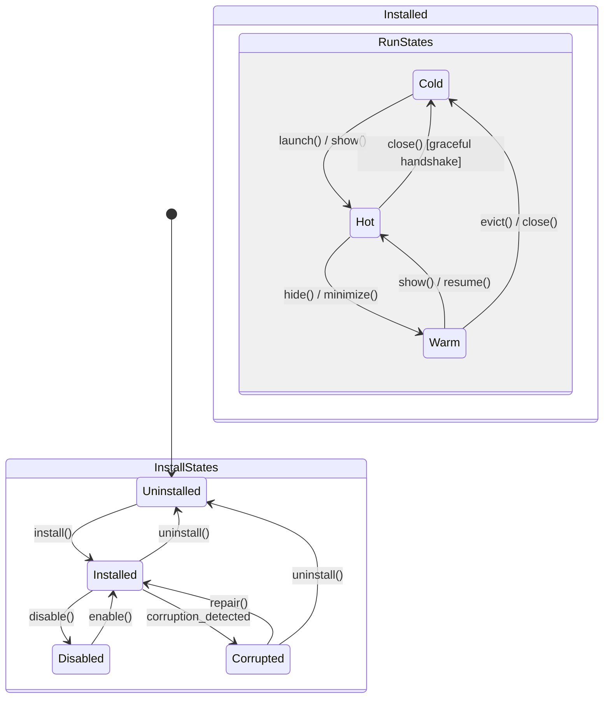
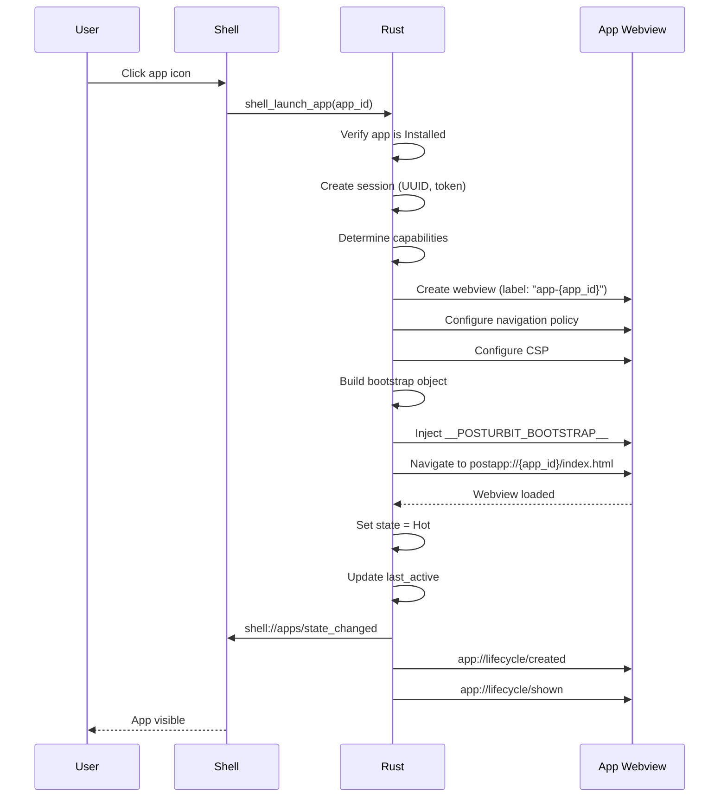

# 08 - App Lifecycle Management Specification

**Status**: Draft
**Created**: 2026-01-20
**Loop**: 9

## 1. Overview and Goals

### Purpose

Define the complete lifecycle management for apps in the Post-Urbit frontend platform, covering installation, state transitions, session management, data handling, upgrades, and uninstallation.

### Goals

- Provide a deterministic state machine for app lifecycle
- Ensure atomic installation and upgrade operations
- Enable graceful resource management with user-transparent state transitions
- Maintain data integrity across lifecycle events
- Support developer mode with relaxed validations

### Non-Goals

- Backend WASM runtime lifecycle (covered separately)
- Network protocol specifics (covered in Transport spec)
- UI component implementation (covered in Shell Architecture)

### Related Specifications

- 02-APP_SANDBOX_ISOLATION.md - AppRunState, webview isolation
- 03-RESOURCE_CONSTRAINTS.md - LRU eviction, graceful handshake
- 04-SECURE_BRIDGE_PROTOCOL.md - Session lifecycle
- 06-PERMISSION_SYSTEM.md - Permission grants and revocation
- 07-SDK_DEVELOPER_EXPERIENCE.md - Bootstrap and session handling

---

## 2. State Machine

### 2.1 Install State

```rust
use serde::{Deserialize, Serialize};
use chrono::{DateTime, Utc};

/// Installation state of an app
#[derive(Debug, Clone, Copy, PartialEq, Eq, Serialize, Deserialize)]
#[serde(rename_all = "snake_case")]
pub enum InstallState {
    /// App is not installed
    Uninstalled,

    /// App is fully installed and available
    Installed,

    /// App is temporarily disabled by user
    Disabled,

    /// App installation is corrupted
    Corrupted,
}
```

### 2.2 Run State

```rust
/// Runtime state of an app (from 02-APP_SANDBOX_ISOLATION.md)
#[derive(Debug, Clone, Copy, PartialEq, Eq, Serialize, Deserialize)]
#[serde(rename_all = "snake_case")]
pub enum AppRunState {
    /// Webview destroyed, state persisted to disk
    Cold,

    /// Hidden but webview still in memory
    Warm,

    /// Actively visible and rendered
    Hot,
}
```

### 2.3 Combined State Diagram



### 2.4 Transition Rules

**Invariant**: Only the shell can cause state transitions. Apps cannot transition their own state.

```rust
/// State transition event
#[derive(Debug, Clone, Serialize, Deserialize)]
#[serde(tag = "type", rename_all = "snake_case")]
pub enum StateTransition {
    // Install state transitions (shell-only)
    Install { source: AppSource },
    Uninstall { keep_data: bool },
    Enable,
    Disable,
    Repair,

    // Run state transitions (shell-only)
    Launch,
    Show,
    Hide,
    Minimize,
    Close { reason: CloseReason },

    // Resource manager overrides
    Evict { reason: EvictionReason },
}

#[derive(Debug, Clone, Serialize, Deserialize)]
#[serde(rename_all = "snake_case")]
pub enum CloseReason {
    UserRequested,
    Eviction { reason: EvictionReason },
    SessionExpired,
    Crash { info: CrashInfo },
    Upgrade,
    Uninstall,
}
```

#### ResourceManager Override Rules

- Focused webview NEVER evicted
- Count-based eviction when hot_count > max_hot_webviews
- Warm pool overflow eviction
- Memory pressure triggers aggressive eviction

---

## 3. Installation Flow

### 3.1 Common Pipeline

```
Acquire → Verify → Stage → Commit → Post-install
```

```rust
/// Installation pipeline stages
#[derive(Debug, Clone, Copy, PartialEq, Eq, Serialize, Deserialize)]
#[serde(rename_all = "snake_case")]
pub enum InstallStage {
    Acquiring,
    Verifying,
    Staging,
    Committing,
    PostInstall,
    Complete,
    Failed { stage: Box<InstallStage>, error: String },
}
```

### 3.2 Source Types

```rust
/// Source of an app installation
#[derive(Debug, Clone, Serialize, Deserialize)]
#[serde(tag = "type", rename_all = "snake_case")]
pub enum AppSource {
    /// Official marketplace with signature verification
    Marketplace {
        repository_url: String,
        app_id: String,
        version: String,
        signature: MarketplaceSignature,
    },

    /// Local .postapp file (user confirmation required)
    LocalFile {
        path: String,
        user_confirmed: bool,
    },

    /// Developer mode (relaxed validation)
    Developer {
        path: String,
        watch_for_changes: bool,
    },
}
```

### 3.3 Source-Specific Validation

| Source | Signature | Hash | User Confirmation | Package Limits |
|--------|-----------|------|-------------------|----------------|
| Marketplace | Required | Required | Install-time perms only | Enforced (150MB) |
| LocalFile | Optional | Required | Required | Enforced (150MB) |
| Developer | None | Optional | None | Relaxed |

### 3.4 Package Format

```
app.postapp (ZIP archive)
├── manifest.json       # App manifest (required)
├── SIGNATURE           # Ed25519 signature
├── main.wasm           # WASM entry point (required)
├── ui/                 # Frontend assets
│   ├── index.html
│   └── assets/
└── assets/             # Static assets
```

### 3.5 Atomic Staging and Commit

```rust
impl AppInstaller {
    pub async fn install(&self, source: AppSource) -> Result<InstalledApp, InstallError> {
        // Stage 1: Acquire
        let package_bytes = self.acquire(&source).await?;

        // Stage 2: Verify
        let parsed = parse_postapp(&package_bytes)?;
        self.verify_package(&parsed, &source).await?;

        // Stage 3: Stage to temporary directory
        let staging_dir = self.create_staging_dir(&parsed.manifest.app.id)?;
        extract_package(&parsed, &staging_dir)?;

        // Stage 4: Atomic commit (rename is atomic)
        let final_dir = self.apps_dir.join(&parsed.manifest.app.id);

        if final_dir.exists() {
            return Err(InstallError::AlreadyInstalled);
        }

        std::fs::rename(&staging_dir, &final_dir)
            .map_err(|e| InstallError::CommitFailed(e.to_string()))?;

        // Stage 5: Post-install
        let installed_app = self.register_app(&parsed.manifest).await?;

        self.emit_event(ShellEvent::AppInstalled {
            app_id: parsed.manifest.app.id.clone(),
            version: parsed.manifest.app.version.clone(),
        });

        Ok(installed_app)
    }
}
```

---

## 4. Launch/Close Flows

### 4.1 Cold Start (Cold → Hot)



### 4.2 Show/Resume (Warm → Hot)

- Bring webview to front
- Update LRU position
- Emit `app://lifecycle/shown`

### 4.3 Hide/Minimize (Hot → Warm)

- Hide webview (keep in memory)
- Emit `app://lifecycle/hidden`

### 4.4 Close (Hot/Warm → Cold)

#### Close Context Types

```rust
#[derive(Debug, Clone, Serialize, Deserialize)]
#[serde(rename_all = "snake_case")]
pub enum CloseContext {
    UserClose,
    Eviction { reason: EvictionReason, graceful: bool },
    SessionExpired,
    Crash { crash_count: u32, error: Option<String> },
    Upgrade { from_version: String, to_version: String },
    Uninstall,
}
```

#### Graceful Close Flow

1. Shell decides to close/evict
2. Emit `app://resource/evicting` with deadline (1500ms)
3. Allow app `prepare_for_unload` response (≤64KB)
4. Persist `PersistedAppState` (geometry, scroll, blob)
5. Emit `app://lifecycle/closed`
6. Destroy webview
7. Invalidate session
8. Set state = Cold

---

## 5. Session Lifecycle

### 5.1 Session Creation and Binding

Sessions are created on Cold→Hot transition and destroyed on →Cold.

```rust
impl SessionManager {
    pub fn create_session(
        &mut self,
        app_id: &str,
        webview_label: &str,
        capabilities: Vec<String>,
    ) -> Result<AppSession, SessionError> {
        let session_id = Uuid::new_v4().to_string();
        let nonce = generate_nonce(32);
        let now = Utc::now();

        let session = AppSession {
            session_id: session_id.clone(),
            app_id: app_id.to_string(),
            webview_label: webview_label.to_string(),
            capabilities,
            created_at: now,
            expires_at: now + self.config.session_ttl,
            nonce,
            token_kid: self.current_token_kid.clone(),
            request_count: AtomicU64::new(0),
            last_activity: AtomicI64::new(now.timestamp_millis()),
        };

        let token = self.generate_token(&session)?;
        self.sessions.insert(session_id.clone(), session);

        Ok((session, token))
    }

    pub fn destroy_session(&mut self, session_id: &str) -> Result<(), SessionError> {
        let session = self.sessions.remove(session_id)
            .ok_or(SessionError::NotFound)?;

        // Expire session-scoped permission grants
        self.permission_store.expire_session_grants(&session.session_id)?;

        // Clear replay cache
        self.replay_cache.clear_session(&session.session_id);

        Ok(())
    }
}
```

### 5.2 Token Expiry Handling (Policy A)

**UNAUTHORIZED forces webview restart** - clean security boundary.

```typescript
// SDK forces reload on UNAUTHORIZED - no retry attempts
if (error.code === 'UNAUTHORIZED') {
    console.error('[PostUrbit] Session expired. Reloading app.');
    window.location.reload();
}
```

### 5.3 Session Invalidation Triggers

| Trigger | Action | Session Fate |
|---------|--------|--------------|
| App close (user) | Graceful handshake | Destroyed |
| App eviction | Graceful handshake | Destroyed |
| Token expiry | UNAUTHORIZED | Destroyed on reload |
| Security event | Immediate invalidation | Destroyed |
| App uninstall | Forced destruction | Destroyed + data wiped |
| App upgrade | Destroy old, create new | Replaced |

---

## 6. Data Management

### 6.1 Data Categories

```rust
#[derive(Debug, Clone, Copy, PartialEq, Eq, Serialize, Deserialize)]
#[serde(rename_all = "snake_case")]
pub enum DataCategory {
    /// UI bundle: {apps_dir}/{app_id}/ui/
    UiBundle,

    /// Runtime web storage (localStorage, IndexedDB)
    RuntimeStorage,

    /// Shell-managed data: {data_dir}/{app_id}/storage/
    ShellManagedData,

    /// Large blobs: {data_dir}/{app_id}/blobs/
    Blobs,
}
```

### 6.2 Quotas (from 03-RESOURCE_CONSTRAINTS.md)

| Category | Soft Limit | Hard Limit |
|----------|------------|------------|
| Package | 75 MB | 150 MB |
| Runtime quota | - | 256 MB |
| Shell data | - | 256 MB |
| Blobs | - | 1 GB |
| Per-app logs | - | 20 MB |

### 6.3 Uninstall Data Handling

```rust
impl AppManager {
    pub async fn uninstall_app(&mut self, app_id: &str, keep_data: bool) -> Result<(), UninstallError> {
        let app = self.apps.get(app_id).ok_or(UninstallError::NotFound)?;

        // Close if running
        if app.run_state != AppRunState::Cold {
            self.close_app(app_id, CloseContext::Uninstall).await?;
        }

        // Revoke permissions
        self.permission_store.revoke_all_for_app(app_id)?;

        // Invalidate sessions
        self.session_manager.invalidate_all_for_app(app_id)?;

        if !keep_data {
            // Remove UI bundle
            let app_dir = self.apps_dir.join(app_id);
            if app_dir.exists() {
                std::fs::remove_dir_all(&app_dir)?;
            }

            // Remove shell-managed data
            let data_dir = self.data_dir.join(app_id);
            if data_dir.exists() {
                std::fs::remove_dir_all(&data_dir)?;
            }

            // Clear runtime web storage
            self.webview_manager.clear_storage_for_origin(
                &format!("postapp://{}", app_id)
            )?;

            // Remove blobs
            self.blob_store.delete_all_for_app(app_id)?;
        }

        // Remove from registry
        self.apps.remove(app_id);

        self.emit_shell_event(ShellEvent::AppUninstalled {
            app_id: app_id.to_string(),
            data_kept: keep_data,
        });

        Ok(())
    }
}
```

### 6.4 Upgrade Data Handling

1. Parse and verify new package
2. Check capability escalation (prompt if new capabilities)
3. Close app if running
4. Create backup of current version
5. Atomic staging and commit
6. Run migration hooks (if defined)
7. Clean up backup after grace period (5 minutes)

**Rollback Triggers**:
- Commit failure
- Migration hook failure
- Startup failure after upgrade

---

## 7. Shell Integration

### 7.1 Shell Commands

```rust
// Installation commands
#[tauri::command]
pub async fn shell_install_app(
    webview: Webview,
    state: State<'_, AppState>,
    source: AppSource,
) -> Result<InstalledApp, String>;

#[tauri::command]
pub async fn shell_uninstall_app(
    webview: Webview,
    state: State<'_, AppState>,
    app_id: String,
    keep_data: bool,
) -> Result<(), String>;

#[tauri::command]
pub async fn shell_update_app(
    webview: Webview,
    state: State<'_, AppState>,
    app_id: String,
    source: AppSource,
) -> Result<UpgradeResult, String>;

// Query commands
#[tauri::command]
pub async fn shell_list_apps(
    webview: Webview,
    state: State<'_, AppState>,
) -> Result<Vec<InstalledAppInfo>, String>;

#[tauri::command]
pub async fn shell_get_app_info(
    webview: Webview,
    state: State<'_, AppState>,
    app_id: String,
) -> Result<AppDetailInfo, String>;

// Lifecycle commands
#[tauri::command]
pub async fn shell_launch_app(
    webview: Webview,
    state: State<'_, AppState>,
    app_id: String,
) -> Result<LaunchResult, String>;

#[tauri::command]
pub async fn shell_show_app(
    webview: Webview,
    state: State<'_, AppState>,
    app_id: String,
) -> Result<(), String>;

#[tauri::command]
pub async fn shell_hide_app(
    webview: Webview,
    state: State<'_, AppState>,
    app_id: String,
) -> Result<(), String>;

#[tauri::command]
pub async fn shell_close_app(
    webview: Webview,
    state: State<'_, AppState>,
    app_id: String,
) -> Result<(), String>;

// Developer commands
#[tauri::command]
pub async fn shell_set_dev_mode(
    webview: Webview,
    state: State<'_, AppState>,
    app_id: String,
    enabled: bool,
    options: Option<DevModeOptions>,
) -> Result<(), String>;
```

### 7.2 Shell Events

```rust
#[derive(Debug, Clone, Serialize, Deserialize)]
#[serde(tag = "event", rename_all = "snake_case")]
pub enum ShellEvent {
    /// shell://apps/installed
    AppInstalled {
        app_id: String,
        version: String,
        source_type: String,
        installed_at: String,
    },

    /// shell://apps/updated
    AppUpdated {
        app_id: String,
        from_version: String,
        to_version: String,
    },

    /// shell://apps/uninstalled
    AppUninstalled {
        app_id: String,
        data_kept: bool,
    },

    /// shell://apps/state_changed
    StateChanged {
        app_id: String,
        old_state: String,
        new_state: String,
        reason: Option<String>,
    },

    /// shell://apps/focus_changed
    FocusChanged {
        app_id: Option<String>,
        previous_app_id: Option<String>,
    },
}
```

### 7.3 App Events

```rust
#[derive(Debug, Clone, Serialize, Deserialize)]
#[serde(tag = "event", rename_all = "snake_case")]
pub enum AppEvent {
    /// app://lifecycle/created
    Created {},

    /// app://lifecycle/shown
    Shown {},

    /// app://lifecycle/hidden
    Hidden {},

    /// app://lifecycle/closed
    Closed { reason: String },

    /// app://lifecycle/upgraded
    Upgraded {
        from_version: String,
        to_version: String,
    },

    /// app://session/expiring
    SessionExpiring { expires_at: String },
}
```

---

## 8. App Registry

### 8.1 Installed App Structure

```rust
#[derive(Debug, Clone, Serialize, Deserialize)]
pub struct InstalledApp {
    pub id: String,
    pub manifest: Manifest,
    pub installed_at: DateTime<Utc>,
    pub installed_from: AppSourceType,
    pub signature_verified: bool,
    pub install_state: InstallState,
    pub run_state: AppRunState,
    pub session_id: Option<String>,
    pub webview_label: Option<String>,
    pub dev_mode: bool,
    pub dev_options: Option<DevModeOptions>,
    pub last_opened: Option<DateTime<Utc>>,
    pub open_count: u64,
    pub storage_used_bytes: u64,
    pub storage_quota_bytes: u64,
    pub granted_capabilities: Vec<String>,
    pub update_available: Option<UpdateInfo>,
}
```

### 8.2 SQLite Schema

```sql
CREATE TABLE installed_apps (
    id TEXT PRIMARY KEY,
    manifest_json TEXT NOT NULL,
    installed_at TEXT NOT NULL,
    installed_from TEXT NOT NULL,
    signature_verified INTEGER NOT NULL DEFAULT 0,
    install_state TEXT NOT NULL DEFAULT 'installed',
    dev_mode INTEGER NOT NULL DEFAULT 0,
    dev_options_json TEXT,
    last_opened TEXT,
    open_count INTEGER NOT NULL DEFAULT 0,
    storage_used_bytes INTEGER NOT NULL DEFAULT 0,
    storage_quota_bytes INTEGER NOT NULL DEFAULT 268435456,
    update_info_json TEXT
);

CREATE TABLE app_sessions (
    session_id TEXT PRIMARY KEY,
    app_id TEXT NOT NULL,
    webview_label TEXT NOT NULL,
    capabilities_json TEXT NOT NULL,
    created_at TEXT NOT NULL,
    expires_at TEXT NOT NULL,
    last_activity TEXT NOT NULL,
    FOREIGN KEY (app_id) REFERENCES installed_apps(id)
);

CREATE TABLE persisted_app_state (
    app_id TEXT PRIMARY KEY,
    session_id TEXT NOT NULL,
    evicted_at TEXT NOT NULL,
    eviction_reason_json TEXT NOT NULL,
    last_url TEXT NOT NULL,
    geometry_json TEXT NOT NULL,
    scroll_json TEXT,
    app_state_blob BLOB,
    app_state_size INTEGER NOT NULL DEFAULT 0,
    FOREIGN KEY (app_id) REFERENCES installed_apps(id)
);

CREATE INDEX idx_sessions_app ON app_sessions(app_id);
CREATE INDEX idx_sessions_expires ON app_sessions(expires_at);
```

---

## 9. Test Scenarios

### 9.1 Installation Tests

| Test | Scenario | Expected |
|------|----------|----------|
| INST-01 | Marketplace install | App installed, event emitted |
| INST-02 | Invalid signature | InstallError::SignatureInvalid |
| INST-03 | Local with confirmation | App installed |
| INST-04 | Local without confirmation | Error: confirmation required |
| INST-05 | Package too large | InstallError::PackageTooLarge |
| INST-06 | Invalid manifest | InstallError::ManifestInvalid |
| INST-07 | Already installed | InstallError::AlreadyInstalled |

### 9.2 State Transition Tests

| Test | Scenario | Expected |
|------|----------|----------|
| LAUNCH-01 | Cold start | Session created, state=Hot |
| LAUNCH-02 | Warm to hot | Webview shown, state=Hot |
| LAUNCH-03 | Hide hot app | State=Warm |
| LAUNCH-04 | Close hot app | Graceful handshake, state=Cold |
| LAUNCH-05 | State restored on relaunch | Geometry/scroll restored |

### 9.3 Eviction Tests

| Test | Scenario | Expected |
|------|----------|----------|
| EVICT-01 | App responds in time | State persisted |
| EVICT-02 | App too slow | Eviction at deadline |
| EVICT-03 | Blob too large | Truncated to 64KB |
| EVICT-04 | Focused never evicted | Next LRU evicted |
| EVICT-05 | Memory pressure | All warm evicted |

### 9.4 Session Tests

| Test | Scenario | Expected |
|------|----------|----------|
| SESS-01 | Session on launch | Token in bootstrap |
| SESS-02 | Wrong webview token | UNAUTHORIZED |
| SESS-03 | Session destroyed on close | Token invalid |
| SESS-04 | Token expiry | UNAUTHORIZED, reload |

### 9.5 Upgrade Tests

| Test | Scenario | Expected |
|------|----------|----------|
| UPGR-01 | Basic upgrade | Files replaced, data preserved |
| UPGR-02 | New capabilities | Permission prompt |
| UPGR-03 | Rollback on failure | Previous version restored |

### 9.6 Uninstall Tests

| Test | Scenario | Expected |
|------|----------|----------|
| UNINST-01 | Uninstall cold app | All data removed |
| UNINST-02 | Uninstall running app | Closed first, then uninstalled |
| UNINST-03 | Keep data option | UI removed, data preserved |

### 9.7 Developer Mode Tests

| Test | Scenario | Expected |
|------|----------|----------|
| DEV-01 | Enable dev mode | Inspector available |
| DEV-02 | Dev install | No signature required |
| DEV-03 | File watching | Reload on change |

---

## 10. Implementation Checklist

### Phase 1: Core Data Structures
- [ ] Define `InstallState`, `AppRunState` enums
- [ ] Define `StateTransition`, `CloseContext` enums
- [ ] Define `InstalledApp` struct
- [ ] Create SQLite schema

### Phase 2: Installation Pipeline
- [ ] Implement `AppSource` enum
- [ ] Implement package verification
- [ ] Implement atomic staging
- [ ] Implement atomic commit
- [ ] Add install events

### Phase 3: State Machine
- [ ] Implement `AppManager` with state tracking
- [ ] Implement launch flow
- [ ] Implement show/hide flows
- [ ] Implement close with graceful handshake
- [ ] Wire ResourceManager triggers

### Phase 4: Session Management
- [ ] Implement `SessionManager`
- [ ] Implement token generation
- [ ] Implement session binding
- [ ] Handle UNAUTHORIZED → reload

### Phase 5: State Persistence
- [ ] Implement geometry capture
- [ ] Implement scroll capture
- [ ] Implement blob storage
- [ ] Implement state restoration

### Phase 6: Shell Commands
- [ ] Implement all shell commands
- [ ] Add shell-only verification

### Phase 7: Events
- [ ] Implement shell events
- [ ] Implement app events

### Phase 8: Upgrade Flow
- [ ] Implement capability escalation
- [ ] Implement atomic upgrade
- [ ] Implement rollback

### Phase 9: Data Management
- [ ] Implement quota enforcement
- [ ] Implement uninstall cleanup

### Phase 10: Developer Mode
- [ ] Implement dev mode toggle
- [ ] Implement file watching
- [ ] Implement CSP relaxation

---

## 11. Acceptance Criteria Matrix

| Requirement | Criteria | Test Method |
|-------------|----------|-------------|
| Atomic install | No partial state on failure | Integration test |
| Signature verification | Marketplace requires valid sig | Unit test |
| State machine | Transitions follow diagram | State machine test |
| Shell-only control | Apps cannot self-transition | Security test |
| Focused never evicted | Focused survives eviction | Integration test |
| Graceful handshake | 1500ms deadline | Timing test |
| State persisted | Restored on relaunch | Integration test |
| Session binding | Wrong webview = UNAUTHORIZED | Security test |
| UNAUTHORIZED reload | Triggers page reload | E2E test |
| Permission revocation | Uninstall revokes all | Integration test |
| Data cleanup | Uninstall removes data | Integration test |
| Atomic upgrade | Failure rolls back | Integration test |
| Capability escalation | New caps prompt | E2E test |
| Events emitted | All transitions emit | Integration test |

---

## Appendix A: Directory Structure

```
{data_dir}/
├── apps/                      # Installed app bundles
│   ├── {app_id}/
│   │   ├── manifest.json
│   │   ├── SIGNATURE
│   │   ├── main.wasm
│   │   └── ui/
│   └── ...
│
├── data/                      # App runtime data
│   ├── {app_id}/
│   │   ├── storage/
│   │   ├── blobs/
│   │   └── logs/
│   └── ...
│
├── staging/                   # Temporary install staging
├── backups/                   # Upgrade backups
├── registry.db                # SQLite app registry
└── persisted_state/           # Eviction state
```

---

## Appendix B: Error Codes

```rust
#[derive(Debug, Clone, Serialize, Deserialize)]
#[serde(rename_all = "SCREAMING_SNAKE_CASE")]
pub enum LifecycleErrorCode {
    AlreadyInstalled,
    PackageTooLarge,
    ManifestInvalid,
    SignatureInvalid,
    HashMismatch,
    UserConfirmationRequired,
    CommitFailed,
    AppNotFound,
    AppDisabled,
    AppCorrupted,
    SessionCreationFailed,
    WebviewCreationFailed,
    InvalidUpgradePath,
    CapabilityEscalationDenied,
    MigrationFailed,
    UninstallFailed,
    NotPermitted,
    InternalError,
}
```
