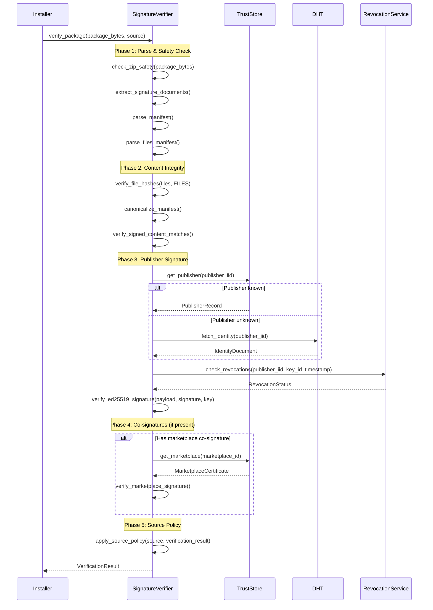
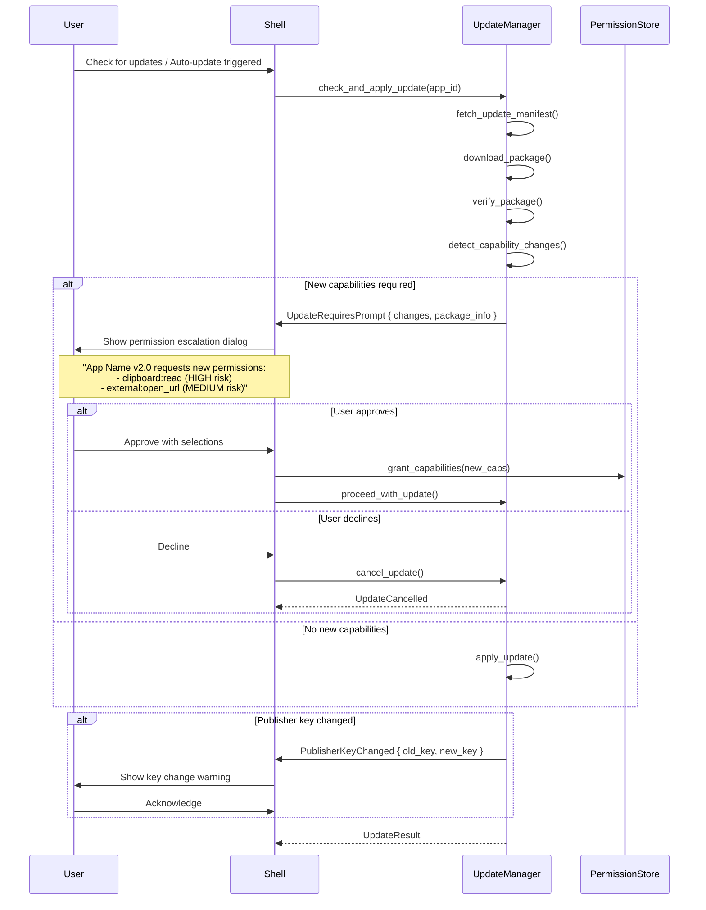

# Domain 6.5: Package Trust & Updates Specification

## Status: Draft
## Version: 1.0.0
## Last Updated: 2026-01-20

---

## Executive Summary

This specification defines the comprehensive trust model, cryptographic verification pipeline, and secure update mechanisms for Post-Urbit's package ecosystem. It addresses:

- **Package format** (.postapp/.postmod) with normative manifest schema
- **Publisher identity** with Ed25519 signatures and key rotation
- **Trust store** with platform roots, marketplaces, and user-trusted publishers
- **Signature verification pipeline** with multi-signature support
- **Update mechanisms** with anti-downgrade and anti-freeze protections
- **Permission escalation** detection and update-time prompting
- **Revocation system** with offline behavior policies
- **Rollback and integrity** verification for reliability

The design builds upon existing infrastructure in `app_store.rs`, `runtime.rs`, and `identity.rs` which already implement Ed25519 signing, SHA-256 file hashing, revocation checking, and IID-based identity binding.

---

## 1. Package Format Specification

### 1.1 ZIP Profile Constraints

```rust
/// ZIP archive constraints for package safety
pub struct ZipProfileConstraints {
    /// Maximum total package size (150 MB)
    pub max_package_bytes: usize,           // 150 * 1024 * 1024

    /// Maximum number of entries in archive
    pub max_entries: usize,                  // 10_000

    /// Maximum compression ratio (decompressed/compressed)
    pub max_compression_ratio: f64,          // 100.0

    /// Maximum single file size after decompression
    pub max_single_file_bytes: usize,        // 50 * 1024 * 1024

    /// Maximum path length
    pub max_path_length: usize,              // 256

    /// Maximum nesting depth
    pub max_nesting_depth: usize,            // 16
}

pub enum ZipViolationType {
    SymlinkDetected,
    HardlinkDetected,
    PathTraversal,
    AbsolutePath,
    DuplicateEntry,
    CompressionBomb,
    TooManyEntries,
    PathTooLong,
    NestingTooDeep,
    InvalidComponent,
    NestedArchive,
}
```

**Safety Invariants:**
- NO symlinks or hardlinks allowed
- NO absolute paths allowed
- NO path traversal (`..` components) allowed
- NO duplicate entries allowed
- NO nested archives (`.zip`, `.postapp`, `.postmod` inside)
- Compression ratio MUST NOT exceed 100:1
- Entry count MUST NOT exceed 10,000
- Path length MUST NOT exceed 256 characters
- Nesting depth MUST NOT exceed 16 levels

### 1.2 Canonical Directory Layout

```
app.postapp (ZIP archive)
├── manifest.json           # Required: App manifest (max 64 KB)
├── SIGNATURE               # Required: Package signature (JSON)
├── FILES                   # Required: Per-file integrity hashes
├── main.wasm               # Required for apps: WASM entry (max 50 MB)
├── ui/                     # Frontend assets (max 20 MB total)
│   ├── index.html
│   └── assets/
├── assets/                 # Static assets (max 10 MB each)
└── migrations/             # Optional: Data migration scripts
    └── v1_to_v2.sql

extension.postmod (ZIP archive)
├── manifest.json           # Required: Extension manifest
├── SIGNATURE               # Required: Package signature
├── FILES                   # Required: Per-file integrity hashes
├── schemas/                # CDDL schema definitions
│   ├── params/*.cddl
│   └── results/*.cddl
└── handlers/               # Future: WASM handlers
    └── handler.wasm
```

### 1.3 Normative Manifest Schema

```rust
/// Complete normative manifest.json schema
#[derive(Debug, Clone, Serialize, Deserialize)]
pub struct PackageManifest {
    /// Schema version (must be 1)
    pub manifest_version: u8,

    /// Package type discriminator
    pub package_type: PackageType,

    /// Application/extension metadata
    pub app: AppMetadata,

    /// Publisher identity binding
    pub publisher: PublisherBinding,

    /// Runtime configuration (apps only)
    #[serde(skip_serializing_if = "Option::is_none")]
    pub runtime: Option<RuntimeConfig>,

    /// Method definitions (extensions only)
    #[serde(skip_serializing_if = "Option::is_none")]
    pub methods: Option<Vec<ExtensionMethod>>,

    /// Required and optional capabilities
    pub capabilities: CapabilitiesConfig,

    /// Secret declarations for network access
    #[serde(skip_serializing_if = "Option::is_none")]
    pub secrets: Option<HashMap<String, SecretDeclaration>>,

    /// Network rate limit configuration
    #[serde(skip_serializing_if = "Option::is_none")]
    pub network: Option<NetworkConfig>,

    /// Dependency declarations
    pub dependencies: DependenciesConfig,

    /// File integrity manifest
    pub files: FilesMetadata,

    /// Update policy configuration
    #[serde(skip_serializing_if = "Option::is_none")]
    pub update_policy: Option<UpdatePolicy>,

    /// Extensions field for future compatibility
    #[serde(default)]
    pub extensions: serde_json::Value,
}

#[derive(Debug, Clone, Copy, PartialEq, Eq, Serialize, Deserialize)]
#[serde(rename_all = "snake_case")]
pub enum PackageType {
    App,
    Extension,
}

#[derive(Debug, Clone, Serialize, Deserialize)]
pub struct AppMetadata {
    /// Unique app identifier (reverse-DNS format)
    pub id: String,

    /// Semantic version
    pub version: String,

    /// Display name
    pub name: String,

    /// Short description (max 140 chars)
    #[serde(skip_serializing_if = "Option::is_none")]
    pub description: Option<String>,

    /// Entry point path
    pub entry_point: String,

    /// Minimum platform version required
    pub min_platform_version: String,
}

/// Publisher identity binding with cryptographic proof
#[derive(Debug, Clone, Serialize, Deserialize)]
pub struct PublisherBinding {
    /// Publisher's Identity ID (IID)
    pub iid: String,

    /// Publisher display name
    pub name: String,

    /// Optional website URL
    #[serde(skip_serializing_if = "Option::is_none")]
    pub url: Option<String>,

    /// Identity verification level
    pub verification: VerificationLevel,
}

#[derive(Debug, Clone, Copy, PartialEq, Eq, Serialize, Deserialize)]
#[serde(rename_all = "snake_case")]
pub enum VerificationLevel {
    /// Self-asserted identity (IID signature only)
    SelfAsserted,
    /// Marketplace-verified (marketplace co-signature)
    MarketplaceVerified,
    /// Domain-verified (DNS TXT record)
    DomainVerified,
}

#[derive(Debug, Clone, Serialize, Deserialize)]
pub struct CapabilitiesConfig {
    /// Required capabilities (installation blocked if not granted)
    pub required: Vec<String>,

    /// Optional capabilities (app can function without)
    #[serde(skip_serializing_if = "Option::is_none")]
    pub optional: Option<Vec<String>>,
}

/// Update policy configuration
#[derive(Debug, Clone, Serialize, Deserialize)]
pub struct UpdatePolicy {
    /// Minimum supported version for updates from
    #[serde(skip_serializing_if = "Option::is_none")]
    pub min_upgrade_from: Option<String>,

    /// Channel this release belongs to
    #[serde(default = "default_channel")]
    pub channel: String,

    /// Whether this version can be frozen (no auto-update)
    #[serde(default)]
    pub allow_freeze: bool,
}

fn default_channel() -> String {
    "stable".to_string()
}
```

### 1.4 Per-File Integrity Hash Manifest (FILES)

```rust
/// FILES manifest format - separate from manifest.json for signature efficiency
#[derive(Debug, Clone, Serialize, Deserialize)]
pub struct FileIntegrityManifest {
    /// Version of FILES format
    pub version: u8,

    /// Algorithm used for hashes
    pub algorithm: String,  // "sha256"

    /// Map of relative path -> hash entry
    pub files: HashMap<String, FileEntry>,

    /// Total size of all files
    pub total_bytes: u64,

    /// Number of files
    pub file_count: usize,
}

#[derive(Debug, Clone, Serialize, Deserialize)]
pub struct FileEntry {
    /// Hash in format "sha256:{hex}"
    pub hash: String,

    /// File size in bytes
    pub size: u64,

    /// Optional MIME type
    #[serde(skip_serializing_if = "Option::is_none")]
    pub content_type: Option<String>,
}
```

### 1.5 SIGNATURE File Format

```rust
/// Enhanced SIGNATURE file format with multi-signature support
#[derive(Debug, Clone, Serialize, Deserialize)]
pub struct PackageSignatureDocument {
    /// Signature format version
    pub signature_version: u8,  // 1

    /// What was signed (manifest hash + files hash)
    pub signed_content: SignedContent,

    /// Primary signature (publisher)
    pub publisher_signature: PublisherSignature,

    /// Optional co-signatures (marketplace, auditors)
    #[serde(default)]
    pub co_signatures: Vec<CoSignature>,
}

#[derive(Debug, Clone, Serialize, Deserialize)]
pub struct SignedContent {
    /// SHA-256 hash of canonicalized manifest.json
    pub manifest_hash: String,

    /// SHA-256 hash of canonicalized FILES
    pub files_hash: String,

    /// Package type for context
    pub package_type: PackageType,

    /// App/extension ID
    pub package_id: String,

    /// Version string
    pub version: String,
}

#[derive(Debug, Clone, Serialize, Deserialize)]
pub struct PublisherSignature {
    /// Publisher's IID
    pub iid: String,

    /// Public key used (for key rotation tracking)
    pub key_id: String,

    /// Signing timestamp (ISO 8601)
    pub timestamp: String,

    /// Ed25519 signature (base64)
    pub signature: String,
}

#[derive(Debug, Clone, Serialize, Deserialize)]
pub struct CoSignature {
    /// Type of co-signer
    pub signer_type: CoSignerType,

    /// Signer's identity
    pub signer_id: String,

    /// Public key used
    pub key_id: String,

    /// Signing timestamp
    pub timestamp: String,

    /// Ed25519 signature (base64)
    pub signature: String,

    /// Optional attestation data
    #[serde(skip_serializing_if = "Option::is_none")]
    pub attestation: Option<serde_json::Value>,
}

#[derive(Debug, Clone, Copy, PartialEq, Eq, Serialize, Deserialize)]
#[serde(rename_all = "snake_case")]
pub enum CoSignerType {
    Marketplace,
    Auditor,
    Enterprise,
}
```

---

## 2. Developer/Publisher Identity

### 2.1 PublisherKey Data Model

```rust
/// Publisher key identifier format
/// Format: "pk:{algorithm}:{key_fingerprint}"
/// Example: "pk:ed25519:a1b2c3d4e5f6..."
pub struct PublisherKeyId {
    /// Algorithm (always "ed25519" for now)
    pub algorithm: String,

    /// SHA-256 fingerprint of public key (first 32 hex chars)
    pub fingerprint: String,
}

impl PublisherKeyId {
    pub fn from_verifying_key(key: &VerifyingKey) -> Self {
        let hash = Sha256::digest(key.as_bytes());
        Self {
            algorithm: "ed25519".to_string(),
            fingerprint: hex::encode(&hash[..16]),
        }
    }

    pub fn to_string(&self) -> String {
        format!("pk:{}:{}", self.algorithm, self.fingerprint)
    }
}

/// Publisher identity record in trust store
#[derive(Debug, Clone, Serialize, Deserialize)]
pub struct PublisherRecord {
    /// Publisher's IID
    pub iid: String,

    /// Display name
    pub display_name: String,

    /// Current signing public key (base64)
    pub current_key: String,

    /// Key ID for current key
    pub current_key_id: String,

    /// Previous keys (for signature verification of old packages)
    pub previous_keys: Vec<PublisherKeyHistory>,

    /// Verification level
    pub verification: VerificationLevel,

    /// When first trusted
    pub trusted_since: String,

    /// Trust source
    pub trust_source: TrustSource,

    /// Optional verified domain
    pub verified_domain: Option<String>,

    /// Optional marketplace verification data
    pub marketplace_verification: Option<MarketplaceVerification>,
}

#[derive(Debug, Clone, Serialize, Deserialize)]
pub struct PublisherKeyHistory {
    pub key: String,
    pub key_id: String,
    pub valid_from: String,
    pub valid_until: String,
    pub rotation_document: Option<String>,
}

#[derive(Debug, Clone, Copy, PartialEq, Eq, Serialize, Deserialize)]
#[serde(rename_all = "snake_case")]
pub enum TrustSource {
    /// User explicitly trusted
    UserTrust,
    /// Came from trusted marketplace
    Marketplace,
    /// First-party/bundled
    Platform,
}
```

### 2.2 Identity Binding Rules

The publisher IID MUST be cryptographically bound to the package signature:

1. **Signature Verification**: The signature MUST be valid under a key that belongs to the IID's signing key history
2. **IID Derivation**: The IID MUST be derived from the genesis signing key
3. **Temporal Validity**: The signature timestamp MUST be within the validity period of the signing key
4. **Revocation Check**: The signing key MUST NOT be revoked at the signature timestamp

### 2.3 Key Rotation Mechanism

Key rotation follows the identity document rotation protocol:

```rust
/// Key rotation handling for package verification
pub struct KeyRotationVerifier {
    dht: Arc<dyn Dht>,
}

impl KeyRotationVerifier {
    /// Verify a signature considering key rotation
    pub async fn verify_with_rotation(
        &self,
        iid: &str,
        payload: &[u8],
        signature: &str,
        signature_timestamp: &str,
    ) -> Result<VerifiedSignature> {
        // 1. Fetch current identity document
        let identity = fetch_identity(&*self.dht, iid).await?
            .ok_or(PostUrbitError::InvalidInput("publisher identity not found"))?;

        // 2. Fetch revocations
        let revocations = fetch_revocations(&*self.dht, iid).await?;

        // 3. Parse signature timestamp
        let signed_at = signature_timestamp.parse::<DateTime<Utc>>()
            .map_err(|_| PostUrbitError::InvalidInput("invalid signature timestamp"))?;

        // 4. Collect all valid keys at signature time
        let valid_keys = self.collect_valid_keys_at(&identity, signed_at, &revocations)?;

        // 5. Try to verify with each valid key
        let sig_bytes = base64_decode(signature)?;
        let sig = Signature::from_bytes(sig_bytes.as_slice().try_into()
            .map_err(|_| PostUrbitError::InvalidInput("signature length"))?);

        for (key_bytes, key_id) in valid_keys {
            let verifying_key = VerifyingKey::from_bytes(&key_bytes)
                .map_err(|_| PostUrbitError::InvalidInput("invalid public key"))?;

            if verifying_key.verify_strict(payload, &sig).is_ok() {
                return Ok(VerifiedSignature {
                    iid: iid.to_string(),
                    key_id,
                    signed_at,
                    key_bytes: key_bytes.to_vec(),
                });
            }
        }

        Err(PostUrbitError::Crypto("signature verification failed"))
    }
}
```

---

## 3. Trust Store

### 3.1 Trust Root Storage Format

```rust
/// Trust store root document
#[derive(Debug, Clone, Serialize, Deserialize)]
pub struct TrustStore {
    /// Trust store format version
    pub version: u8,

    /// Platform trust roots (bundled, immutable)
    pub platform_roots: Vec<PlatformTrustRoot>,

    /// Marketplace certificates
    pub marketplace_certificates: Vec<MarketplaceCertificate>,

    /// User-trusted publishers
    pub trusted_publishers: Vec<PublisherRecord>,

    /// Revocation list references
    pub revocation_sources: Vec<RevocationSource>,

    /// Last update timestamp
    pub updated_at: String,

    /// Integrity hash of this document
    pub integrity_hash: String,
}

#[derive(Debug, Clone, Serialize, Deserialize)]
pub struct PlatformTrustRoot {
    /// Root identifier
    pub root_id: String,

    /// Root public key (base64)
    pub public_key: String,

    /// Key ID
    pub key_id: String,

    /// Purpose of this root
    pub purpose: TrustRootPurpose,

    /// Expiration (None = never expires)
    pub expires_at: Option<String>,
}

#[derive(Debug, Clone, Copy, PartialEq, Eq, Serialize, Deserialize)]
#[serde(rename_all = "snake_case")]
pub enum TrustRootPurpose {
    MarketplaceSigning,
    PlatformUpdates,
    RevocationSigning,
}

#[derive(Debug, Clone, Serialize, Deserialize)]
pub struct MarketplaceCertificate {
    /// Marketplace identifier
    pub marketplace_id: String,

    /// Marketplace name
    pub name: String,

    /// Marketplace operator IID
    pub operator_iid: String,

    /// Marketplace signing public key
    pub signing_key: String,

    /// Key ID
    pub key_id: String,

    /// API endpoint for updates
    pub api_endpoint: String,

    /// When this marketplace was trusted
    pub trusted_since: String,

    /// Certificate signed by platform root
    pub platform_attestation: String,

    /// Certificate expiration
    pub expires_at: String,
}
```

### 3.2 Trust Store SQLite Schema

```sql
-- Trust store schema version: 1

-- Platform trust roots (read-only after initial population)
CREATE TABLE platform_trust_roots (
    root_id TEXT PRIMARY KEY,
    public_key TEXT NOT NULL,
    key_id TEXT NOT NULL,
    purpose TEXT NOT NULL,
    expires_at TEXT,
    created_at TEXT NOT NULL
);

-- Marketplace certificates
CREATE TABLE marketplace_certificates (
    marketplace_id TEXT PRIMARY KEY,
    name TEXT NOT NULL,
    operator_iid TEXT NOT NULL,
    signing_key TEXT NOT NULL,
    key_id TEXT NOT NULL,
    api_endpoint TEXT NOT NULL,
    trusted_since TEXT NOT NULL,
    platform_attestation TEXT NOT NULL,
    expires_at TEXT NOT NULL,
    is_active INTEGER NOT NULL DEFAULT 1
);

-- Trusted publishers
CREATE TABLE trusted_publishers (
    iid TEXT PRIMARY KEY,
    display_name TEXT NOT NULL,
    current_key TEXT NOT NULL,
    current_key_id TEXT NOT NULL,
    verification TEXT NOT NULL,
    trusted_since TEXT NOT NULL,
    trust_source TEXT NOT NULL,
    verified_domain TEXT,
    marketplace_id TEXT,
    is_revoked INTEGER NOT NULL DEFAULT 0,
    revoked_at TEXT,
    FOREIGN KEY (marketplace_id) REFERENCES marketplace_certificates(marketplace_id)
);

-- Publisher key history
CREATE TABLE publisher_key_history (
    id INTEGER PRIMARY KEY AUTOINCREMENT,
    iid TEXT NOT NULL,
    key TEXT NOT NULL,
    key_id TEXT NOT NULL,
    valid_from TEXT NOT NULL,
    valid_until TEXT NOT NULL,
    rotation_document TEXT,
    FOREIGN KEY (iid) REFERENCES trusted_publishers(iid)
);

CREATE INDEX idx_publisher_keys_iid ON publisher_key_history(iid);
CREATE INDEX idx_publisher_keys_key_id ON publisher_key_history(key_id);

-- Revocation cache
CREATE TABLE revocation_cache (
    id INTEGER PRIMARY KEY AUTOINCREMENT,
    subject_type TEXT NOT NULL,  -- 'publisher', 'key', 'package'
    subject_id TEXT NOT NULL,
    revocation_type TEXT NOT NULL,
    effective_at TEXT NOT NULL,
    reason TEXT,
    source TEXT NOT NULL,
    fetched_at TEXT NOT NULL,
    signature TEXT NOT NULL,
    UNIQUE(subject_type, subject_id, revocation_type)
);

CREATE INDEX idx_revocation_subject ON revocation_cache(subject_type, subject_id);
```

### 3.3 Trust Store Modification Invariant

**CRITICAL**: Trust store modifications MUST only occur through Rust backend code, never from WebView/JavaScript. This is enforced by:

1. Trust management commands are shell-only (capability-checked)
2. SQLite database has file permissions restricting access
3. All trust modifications emit audit events

---

## 4. Signature Verification Pipeline

### 4.1 Verification Flow



### 4.2 Canonicalization Rules

```rust
/// Canonicalization for signing
pub mod canonicalization {
    /// Canonicalize a JSON value for signing
    /// Rules:
    /// 1. Object keys sorted lexicographically
    /// 2. No whitespace
    /// 3. Unicode escaped (\uXXXX format)
    /// 4. Numbers represented as-is (no trailing zeros normalization)
    pub fn canonicalize_json(value: &Value) -> Result<String>;

    /// Compute the hash of canonicalized content
    pub fn canonical_hash(value: &Value) -> Result<String>;

    /// Build the signature payload
    /// Format: "{domain}:{manifest_hash}:{files_hash}:{timestamp}"
    pub fn build_signature_payload(
        domain: &str,
        manifest_hash: &str,
        files_hash: &str,
        timestamp: &str,
    ) -> String;
}

/// Signature payload domains
pub const POSTAPP_SIGNATURE_DOMAIN: &str = "postapp-signature-v1";
pub const POSTMOD_SIGNATURE_DOMAIN: &str = "postmod-signature-v1";
pub const MARKETPLACE_COSIGN_DOMAIN: &str = "marketplace-cosign-v1";
```

### 4.3 Source-Specific Verification Policy

```rust
/// Verification policy based on installation source
pub struct VerificationPolicy {
    /// Require valid publisher signature
    pub require_publisher_signature: bool,

    /// Require marketplace co-signature
    pub require_marketplace_cosign: bool,

    /// Require publisher in trust store
    pub require_trusted_publisher: bool,

    /// Allow self-asserted identity
    pub allow_self_asserted: bool,

    /// Require file hash verification
    pub require_file_hashes: bool,

    /// Allow installation if publisher unknown (with prompt)
    pub allow_untrusted_with_prompt: bool,
}

impl VerificationPolicy {
    pub fn for_source(source: &AppSource) -> Self {
        match source {
            AppSource::Marketplace { .. } => Self {
                require_publisher_signature: true,
                require_marketplace_cosign: true,
                require_trusted_publisher: false,  // Marketplace vouches
                allow_self_asserted: false,
                require_file_hashes: true,
                allow_untrusted_with_prompt: false,
            },
            AppSource::LocalFile { .. } => Self {
                require_publisher_signature: true,
                require_marketplace_cosign: false,
                require_trusted_publisher: false,
                allow_self_asserted: true,
                require_file_hashes: true,
                allow_untrusted_with_prompt: true,  // User must confirm
            },
            AppSource::Developer { .. } => Self {
                require_publisher_signature: false,
                require_marketplace_cosign: false,
                require_trusted_publisher: false,
                allow_self_asserted: true,
                require_file_hashes: false,  // Relaxed for dev
                allow_untrusted_with_prompt: false,
            },
        }
    }
}
```

---

## 5. Update Mechanisms

### 5.1 Marketplace Update Protocol

```rust
/// Update metadata from marketplace
#[derive(Debug, Clone, Serialize, Deserialize)]
pub struct UpdateManifest {
    /// Manifest version
    pub version: u8,

    /// App/extension ID
    pub package_id: String,

    /// Available versions
    pub versions: Vec<VersionInfo>,

    /// Update constraints
    pub constraints: UpdateConstraints,

    /// Manifest signed by marketplace
    pub signature: MarketplaceSignature,

    /// Timestamp
    pub timestamp: String,
}

#[derive(Debug, Clone, Serialize, Deserialize)]
pub struct VersionInfo {
    /// Version string
    pub version: String,

    /// Release channel
    pub channel: String,

    /// Minimum version to upgrade from
    pub min_upgrade_from: Option<String>,

    /// Download URL
    pub download_url: String,

    /// Package size
    pub size_bytes: u64,

    /// Package hash
    pub package_hash: String,

    /// Release timestamp
    pub released_at: String,

    /// Changelog
    pub changelog: Option<String>,

    /// Whether this version is deprecated
    pub deprecated: bool,

    /// Security advisory (if any)
    pub security_advisory: Option<SecurityAdvisory>,
}

#[derive(Debug, Clone, Serialize, Deserialize)]
pub struct UpdateConstraints {
    /// Minimum allowed version (anti-downgrade)
    pub minimum_version: String,

    /// Maximum staleness before forced update (anti-freeze)
    pub max_staleness_days: Option<u32>,

    /// Versions with known vulnerabilities
    pub vulnerable_versions: Vec<VulnerableVersion>,
}
```

### 5.2 Anti-Downgrade Protection

```rust
/// Installed package record with version tracking
#[derive(Debug, Clone, Serialize, Deserialize)]
pub struct InstalledPackageRecord {
    pub package_id: String,
    pub package_type: PackageType,
    pub installed_version: String,
    pub installed_at: String,
    pub installed_from: AppSourceType,
    pub publisher_iid: String,
    pub publisher_key_id: String,

    /// Anti-downgrade: highest version ever installed
    pub highest_installed_version: String,

    /// Anti-freeze: last update check timestamp
    pub last_update_check: Option<String>,

    /// Update channel
    pub update_channel: String,

    /// Whether auto-update is enabled
    pub auto_update: bool,

    /// Frozen status (user explicitly declined updates)
    pub frozen: bool,
    pub frozen_at: Option<String>,
    pub frozen_reason: Option<String>,
}

impl InstalledPackageRecord {
    /// Check if a version is allowed (anti-downgrade)
    pub fn can_install_version(&self, new_version: &str) -> Result<bool> {
        let highest = semver::Version::parse(&self.highest_installed_version)?;
        let new = semver::Version::parse(new_version)?;

        // Downgrade below highest ever installed is blocked
        if new < highest {
            return Ok(false);
        }

        Ok(true)
    }
}
```

### 5.3 Anti-Freeze Protection

```rust
/// Update staleness checker
pub struct UpdateStalenessChecker {
    /// Maximum days without update check before warning
    pub warning_threshold_days: u32,  // Default: 30

    /// Maximum days without update check before forced check
    pub forced_check_threshold_days: u32,  // Default: 90

    /// Maximum days without update before blocking launch
    pub block_threshold_days: Option<u32>,  // Default: None (don't block)
}

#[derive(Debug, Clone)]
pub enum StalenessStatus {
    Fresh,
    Warning { days_since: u32 },
    ForcedCheckRequired { days_since: u32 },
    Blocked { days_since: u32 },
    NeverChecked,
}
```

---

## 6. Permission Escalation on Update

### 6.1 Capability Change Detection

```rust
/// Detect capability changes between versions
pub struct CapabilityChangeDetector;

impl CapabilityChangeDetector {
    pub fn detect_changes(
        old_manifest: &PackageManifest,
        new_manifest: &PackageManifest,
    ) -> CapabilityChanges;
}

#[derive(Debug, Clone)]
pub struct CapabilityChanges {
    pub added_required: Vec<String>,
    pub removed_required: Vec<String>,
    pub added_optional: Vec<String>,
    pub removed_optional: Vec<String>,
    pub promoted_to_required: Vec<String>,
    pub demoted_to_optional: Vec<String>,
}

impl CapabilityChanges {
    pub fn requires_prompt(&self) -> bool {
        !self.added_required.is_empty() || !self.promoted_to_required.is_empty()
    }

    pub fn is_escalation(&self) -> bool {
        !self.added_required.is_empty()
    }
}
```

### 6.2 Update-Time Prompt Flow



### 6.3 Publisher Key Change Handling

```rust
/// Handle publisher key changes during update
pub struct PublisherKeyChangePolicy {
    /// Require user acknowledgment for any key change
    pub require_acknowledgment: bool,

    /// Block updates if key changed and no rotation proof
    pub require_rotation_proof: bool,

    /// Grace period for using old key after rotation (hours)
    pub rotation_grace_period_hours: u32,
}

impl Default for PublisherKeyChangePolicy {
    fn default() -> Self {
        Self {
            require_acknowledgment: true,
            require_rotation_proof: true,
            rotation_grace_period_hours: 72,
        }
    }
}

#[derive(Debug, Clone)]
pub enum KeyChangeVerificationResult {
    /// Key unchanged
    Unchanged,

    /// Key rotated with valid proof
    ValidRotation {
        old_key_id: String,
        new_key_id: String,
        rotation_timestamp: String,
    },

    /// Key changed without rotation proof - suspicious
    UnprovenChange {
        old_key_id: String,
        new_key_id: String,
        risk_level: KeyChangeRiskLevel,
    },
}

#[derive(Debug, Clone, Copy, PartialEq, Eq)]
pub enum KeyChangeRiskLevel {
    Low,     // Key in rotation history, within grace period
    Medium,  // Key in rotation history, outside grace period
    High,    // Key not in rotation history
}
```

---

## 7. Revocation System

### 7.1 Revocation Types

```rust
/// Comprehensive revocation types
#[derive(Debug, Clone, Serialize, Deserialize)]
#[serde(tag = "type", rename_all = "snake_case")]
pub enum PackageRevocation {
    /// Specific package version revoked
    PackageVersion(PackageVersionRevocation),

    /// Publisher identity revoked (all packages)
    PublisherIdentity(PublisherIdentityRevocation),

    /// Publisher key revoked (packages signed with this key)
    PublisherKey(PublisherKeyRevocation),

    /// Marketplace certificate revoked
    MarketplaceCertificate(MarketplaceCertificateRevocation),
}

#[derive(Debug, Clone, Serialize, Deserialize)]
pub struct PackageVersionRevocation {
    pub package_id: String,
    pub version: String,
    pub reason: RevocationReason,
    pub effective_at: String,
    pub advisory_url: Option<String>,
    pub replacement_version: Option<String>,
    pub signature: String,
}

#[derive(Debug, Clone, Serialize, Deserialize)]
#[serde(rename_all = "snake_case")]
pub enum RevocationReason {
    SecurityVulnerability { severity: VulnerabilitySeverity, cve: Option<String> },
    Malware { detection_source: String },
    PolicyViolation { policy_id: String },
    KeyCompromise,
    PublisherRequest,
    LegalRequirement,
    Other { description: String },
}

#[derive(Debug, Clone, Copy, PartialEq, Eq, Serialize, Deserialize)]
#[serde(rename_all = "snake_case")]
pub enum VulnerabilitySeverity {
    Low,
    Medium,
    High,
    Critical,
}
```

### 7.2 Revocation Checking

```rust
/// Revocation check result
#[derive(Debug, Clone)]
pub enum RevocationCheckResult {
    NotRevoked,
    Revoked {
        revocation_type: String,
        reason: RevocationReason,
        effective_at: String,
    },
}
```

### 7.3 Offline Behavior Policy

```rust
/// Offline revocation policy
pub struct OfflineRevocationPolicy {
    /// Maximum age of cached revocation data before blocking install
    pub max_cache_age_hours: u32,  // Default: 24

    /// Grace period for already-installed apps when offline
    pub installed_grace_days: u32,  // Default: 7

    /// Action when revocation check fails
    pub on_check_failure: OfflineAction,
}

#[derive(Debug, Clone, Copy)]
pub enum OfflineAction {
    /// Allow with warning
    AllowWithWarning,
    /// Block installation
    Block,
    /// Allow only for previously-trusted publishers
    AllowTrustedOnly,
}

impl Default for OfflineRevocationPolicy {
    fn default() -> Self {
        Self {
            max_cache_age_hours: 24,
            installed_grace_days: 7,
            on_check_failure: OfflineAction::AllowTrustedOnly,
        }
    }
}
```

### 7.4 Installed-but-Revoked App Handling

| Revocation Type | Severity | Action |
|-----------------|----------|--------|
| PackageVersion | Malware | Immediate disable, critical notification |
| PackageVersion | Critical vulnerability | Block launch, urgent notification |
| PackageVersion | Other | Warning notification only |
| PublisherIdentity | Any | Disable all apps, critical notification |
| PublisherKey | Any | Disable apps signed with key, critical notification |

---

## 8. Rollback and Integrity

### 8.1 Rollback Policy

```rust
/// Rollback policy and triggers
pub struct RollbackPolicy {
    /// Maximum rollback versions to keep
    pub max_rollback_versions: usize,  // Default: 2

    /// Automatic rollback on crash (startup crash count threshold)
    pub auto_rollback_crash_threshold: u32,  // Default: 3

    /// Time window for crash counting (seconds)
    pub crash_count_window_secs: u64,  // Default: 300

    /// Allow manual rollback by user
    pub allow_manual_rollback: bool,  // Default: true
}

#[derive(Debug, Clone)]
pub enum RollbackReason {
    RepeatedCrashes { crash_count: u32, backup_version: String },
    UserRequested { backup_version: String },
    UpdateFailure { failed_version: String },
    IntegrityFailure { detected_corruption: String },
}
```

### 8.2 Launch-Time Integrity Verification

```rust
/// Launch-time integrity checker
pub struct IntegrityVerifier {
    db: SqlitePool,
}

impl IntegrityVerifier {
    /// Verify app integrity before launch
    pub async fn verify_before_launch(&self, app_id: &str) -> Result<IntegrityStatus>;
}

#[derive(Debug, Clone)]
pub enum IntegrityStatus {
    Valid,
    Corrupted { reason: String },
    Unknown { reason: String },
}
```

**Verification Strategy:**
1. Check critical files exist (manifest.json, entry_point)
2. Spot-check critical file hashes (manifest, entry_point, index.html)
3. Full verification if last full check was > 24 hours ago

### 8.3 Measured Install Record Schema

```sql
-- Installed packages table with full measurement
CREATE TABLE installed_packages (
    package_id TEXT PRIMARY KEY,
    package_type TEXT NOT NULL,
    installed_version TEXT NOT NULL,
    installed_at TEXT NOT NULL,
    installed_from TEXT NOT NULL,

    -- Publisher info
    publisher_iid TEXT NOT NULL,
    publisher_key_id TEXT NOT NULL,
    publisher_verification TEXT NOT NULL,

    -- Signature info
    manifest_hash TEXT NOT NULL,
    files_hash TEXT NOT NULL,
    signature_timestamp TEXT NOT NULL,

    -- Marketplace co-signature (if present)
    marketplace_id TEXT,
    marketplace_signature_timestamp TEXT,

    -- Anti-downgrade
    highest_installed_version TEXT NOT NULL,

    -- Update tracking
    update_channel TEXT NOT NULL DEFAULT 'stable',
    last_update_check TEXT,
    auto_update INTEGER NOT NULL DEFAULT 1,
    frozen INTEGER NOT NULL DEFAULT 0,
    frozen_at TEXT,
    frozen_reason TEXT,

    -- Integrity tracking
    last_integrity_check TEXT,
    integrity_status TEXT NOT NULL DEFAULT 'valid',

    -- Runtime state
    install_state TEXT NOT NULL DEFAULT 'installed',
    is_disabled INTEGER NOT NULL DEFAULT 0,
    disabled_reason TEXT
);

-- Per-file hashes for integrity verification
CREATE TABLE installed_package_files (
    id INTEGER PRIMARY KEY AUTOINCREMENT,
    package_id TEXT NOT NULL,
    file_path TEXT NOT NULL,
    file_hash TEXT NOT NULL,
    file_size INTEGER NOT NULL,
    FOREIGN KEY (package_id) REFERENCES installed_packages(package_id),
    UNIQUE(package_id, file_path)
);

CREATE INDEX idx_package_files ON installed_package_files(package_id);

-- Installation audit log
CREATE TABLE install_audit_log (
    id INTEGER PRIMARY KEY AUTOINCREMENT,
    timestamp TEXT NOT NULL,
    package_id TEXT NOT NULL,
    event_type TEXT NOT NULL,
    event_data TEXT,  -- JSON
    FOREIGN KEY (package_id) REFERENCES installed_packages(package_id)
);

CREATE INDEX idx_audit_package ON install_audit_log(package_id);
CREATE INDEX idx_audit_time ON install_audit_log(timestamp);

-- Backup records for rollback
CREATE TABLE package_backups (
    id INTEGER PRIMARY KEY AUTOINCREMENT,
    package_id TEXT NOT NULL,
    version TEXT NOT NULL,
    backup_path TEXT NOT NULL,
    created_at TEXT NOT NULL,
    integrity_hash TEXT NOT NULL,
    FOREIGN KEY (package_id) REFERENCES installed_packages(package_id)
);

CREATE INDEX idx_backups_package ON package_backups(package_id);
```

---

## 9. Security Boundaries

### 9.1 ZIP Bomb Defense

```rust
/// ZIP bomb detection and prevention
pub struct ZipBombDetector {
    max_compression_ratio: f64,      // 100.0
    max_decompressed_size: usize,    // 150 MB
    max_entries: usize,              // 10,000
    max_nesting_depth: usize,        // 16
}

impl ZipBombDetector {
    pub fn check(&self, archive: &mut ZipArchive<impl Read + Seek>) -> Result<()>;
}
```

**Checks performed:**
1. Entry count limit
2. Recursive archive detection (reject .zip, .postapp, .postmod inside)
3. Path nesting depth limit
4. Running total decompressed size limit
5. Per-entry compression ratio check
6. Overall compression ratio check

### 9.2 Symlink/Hardlink Rejection

```rust
/// Detect and reject symlinks and hardlinks
pub fn check_entry_type(entry: &ZipFile) -> Result<()> {
    // Check Unix permissions for symlink flag (S_IFLNK = 0o120000)
    if let Some(mode) = entry.unix_mode() {
        if (mode & 0o170000) == 0o120000 {
            return Err(PostUrbitError::InvalidInput("symlinks not allowed"));
        }
    }

    // Check external attributes for Windows reparse points
    // FILE_ATTRIBUTE_REPARSE_POINT = 0x400
    let external_attrs = entry.external_attributes();
    if (external_attrs >> 16) & 0x400 != 0 {
        return Err(PostUrbitError::InvalidInput("reparse points not allowed"));
    }

    Ok(())
}
```

### 9.3 Pre-Verification Content Isolation

**Invariant:** A package is untrusted until verification completes. No package-provided content may be rendered or executed before verification.

```rust
/// Isolate package content before full verification
pub struct PackageIsolator {
    staging_dir: PathBuf,
    verified_dir: PathBuf,
}

impl PackageIsolator {
    /// Extract to isolated staging directory
    pub fn extract_to_staging(&self, package_bytes: &[u8], package_id: &str) -> Result<StagedPackage>;

    /// Move verified package to final location
    pub fn commit_verified(&self, staged: &StagedPackage, app_id: &str) -> Result<PathBuf>;

    /// Clean up staged package (on failure)
    pub fn cleanup_staged(&self, staged: &StagedPackage);
}
```

---

## 10. Shell Commands

### Trust Management

| Command | Description | Capability |
|---------|-------------|------------|
| `shell_list_trusted_publishers` | List all trusted publishers | ShellOnly |
| `shell_trust_publisher` | Add publisher to trust store | ShellOnly |
| `shell_revoke_publisher_trust` | Remove publisher trust | ShellOnly |
| `shell_list_marketplaces` | List trusted marketplaces | ShellOnly |
| `shell_check_package_signature` | Verify package signature | ShellOnly |
| `shell_get_package_info` | Get package manifest info | ShellOnly |

### Update Management

| Command | Description | Capability |
|---------|-------------|------------|
| `shell_check_for_updates` | Check for available updates | ShellOnly |
| `shell_apply_update` | Apply pending update | ShellOnly |
| `shell_rollback_app` | Rollback to previous version | ShellOnly |
| `shell_freeze_app_version` | Freeze app at current version | ShellOnly |
| `shell_unfreeze_app` | Unfreeze app for updates | ShellOnly |
| `shell_sync_revocations` | Sync revocation lists | ShellOnly |

---

## 11. Test Scenarios

| Test ID | Category | Scenario | Expected Result |
|---------|----------|----------|-----------------|
| TRUST-01 | Signature | Valid publisher signature | Install succeeds |
| TRUST-02 | Signature | Invalid publisher signature | Install blocked |
| TRUST-03 | Signature | Signature by revoked key | Install blocked |
| TRUST-04 | Signature | Signature timestamp in future | Install blocked |
| TRUST-05 | Signature | Signature before genesis | Install blocked |
| TRUST-06 | Signature | Marketplace co-signature missing (marketplace source) | Install blocked |
| TRUST-07 | Signature | Valid rotated key signature | Install succeeds |
| ZIP-01 | Archive | Path traversal attempt | Parse fails |
| ZIP-02 | Archive | Absolute path in entry | Parse fails |
| ZIP-03 | Archive | Symlink entry | Parse fails |
| ZIP-04 | Archive | Compression bomb (high ratio) | Parse fails |
| ZIP-05 | Archive | Too many entries | Parse fails |
| ZIP-06 | Archive | Duplicate entries | Parse fails |
| ZIP-07 | Archive | Nested archive | Parse fails |
| UPDATE-01 | Anti-downgrade | Install older version | Blocked |
| UPDATE-02 | Anti-downgrade | Install equal version | Blocked |
| UPDATE-03 | Anti-freeze | App not updated for 90+ days | Forced update check |
| UPDATE-04 | Escalation | New required capability | Prompt shown |
| UPDATE-05 | Escalation | User denies escalation | Update cancelled |
| UPDATE-06 | Key change | Key rotated with proof | Update succeeds |
| UPDATE-07 | Key change | Key changed without proof | Warning + confirmation required |
| REVOKE-01 | Revocation | Install revoked package | Install blocked |
| REVOKE-02 | Revocation | Launch revoked installed app | Depends on severity |
| REVOKE-03 | Revocation | Publisher identity revoked | All apps disabled |
| REVOKE-04 | Revocation | Offline with stale cache | Policy-dependent |
| ROLLBACK-01 | Rollback | Repeated crashes trigger rollback | Rollback to previous version |
| ROLLBACK-02 | Rollback | User-requested rollback | Rollback succeeds |
| ROLLBACK-03 | Rollback | Integrity failure triggers rollback | Rollback or disable |
| INTEGRITY-01 | Integrity | Launch with valid files | Launch succeeds |
| INTEGRITY-02 | Integrity | Launch with corrupted manifest | Launch blocked |
| INTEGRITY-03 | Integrity | Launch with modified WASM | Launch blocked |

---

## 12. Implementation Checklist

### Phase 1: Package Format
- [ ] Implement ZIP safety checks (symlinks, traversal, bombs)
- [ ] Implement FILES manifest parsing
- [ ] Implement SIGNATURE document parsing
- [ ] Implement canonicalization for manifest
- [ ] Add duplicate entry detection
- [ ] Add compression ratio validation

### Phase 2: Signature Verification
- [ ] Implement Ed25519 signature verification
- [ ] Implement key rotation verification
- [ ] Implement publisher identity resolution via DHT
- [ ] Implement signature payload building
- [ ] Implement multi-signature verification

### Phase 3: Trust Store
- [ ] Create trust store SQLite schema
- [ ] Implement platform root initialization
- [ ] Implement marketplace certificate management
- [ ] Implement publisher trust management
- [ ] Implement Rust-only modification invariant

### Phase 4: Revocation System
- [ ] Implement revocation document types
- [ ] Implement DHT revocation fetching
- [ ] Implement HTTP CRL fetching
- [ ] Implement revocation cache
- [ ] Implement offline behavior policy

### Phase 5: Update Mechanism
- [ ] Implement update manifest parsing
- [ ] Implement anti-downgrade enforcement
- [ ] Implement anti-freeze checking
- [ ] Implement capability change detection
- [ ] Implement update-time prompting

### Phase 6: Rollback and Integrity
- [ ] Implement backup creation before update
- [ ] Implement rollback manager
- [ ] Implement crash-based rollback trigger
- [ ] Implement launch-time integrity verification
- [ ] Implement full integrity verification

### Phase 7: Shell Integration
- [ ] Implement trust management commands
- [ ] Implement update commands
- [ ] Implement rollback commands
- [ ] Implement revocation sync commands

### Phase 8: Testing
- [ ] Implement signature verification tests
- [ ] Implement ZIP safety tests
- [ ] Implement anti-downgrade tests
- [ ] Implement revocation tests
- [ ] Implement rollback tests

---

## Cross-Spec Dependencies

| Dependency | Spec | Resolution |
|------------|------|------------|
| AppSource enum | 08-APP_LIFECYCLE | Use AppSource for source-specific policy |
| Installation pipeline | 08-APP_LIFECYCLE | Integrate verification into install flow |
| Permission system | 06-PERMISSION_SYSTEM | Escalation prompts use permission grant flow |
| Protocol registry | 05-PROTOCOL_REGISTRY | Extension signing uses same key infrastructure |
| Identity documents | (Rust code) | Leverage existing IID/key rotation in identity.rs |
| Revocation handling | (Rust code) | Extend existing RevocationDocument types |
